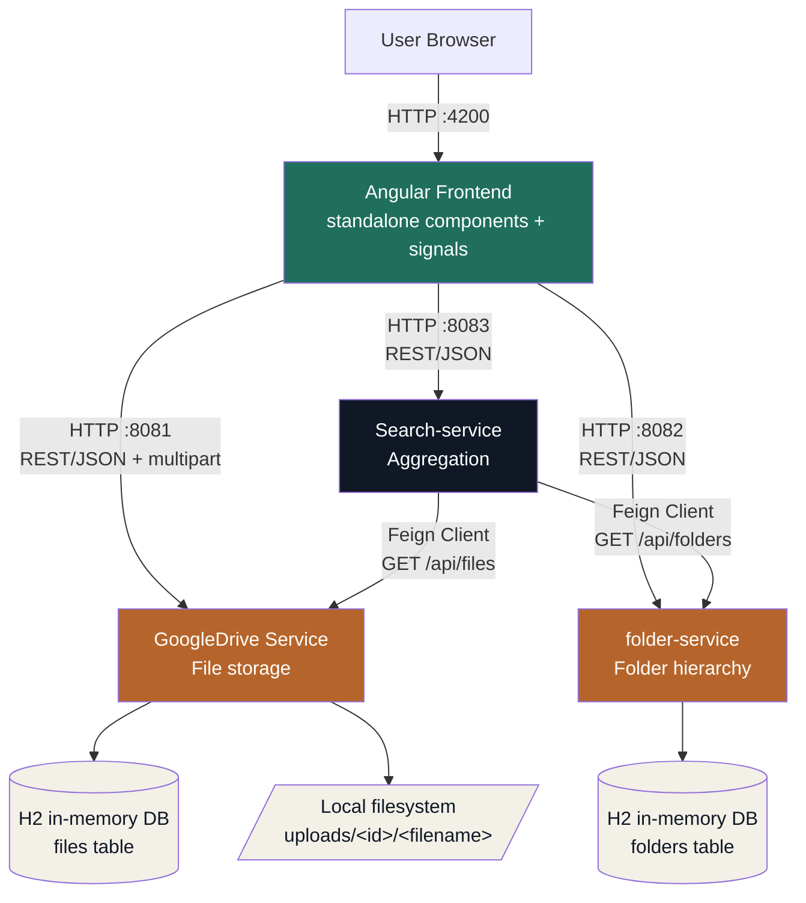
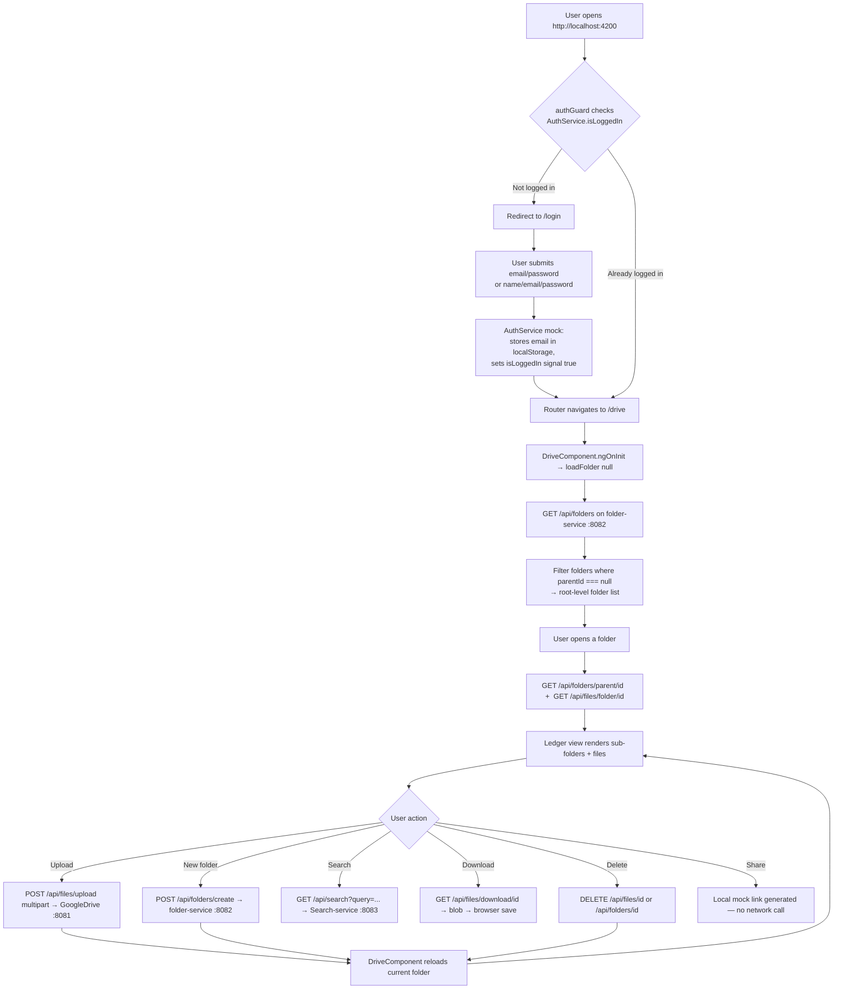
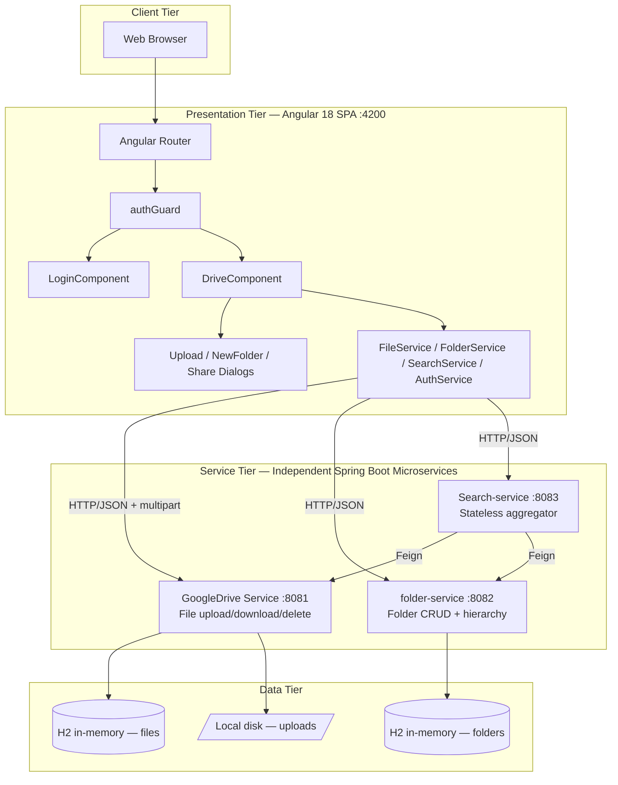
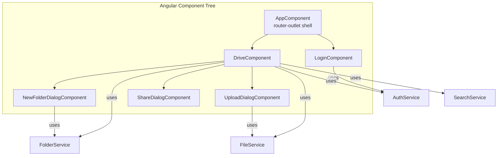
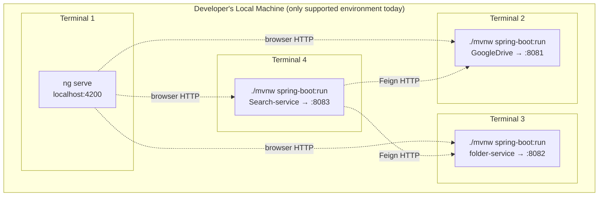
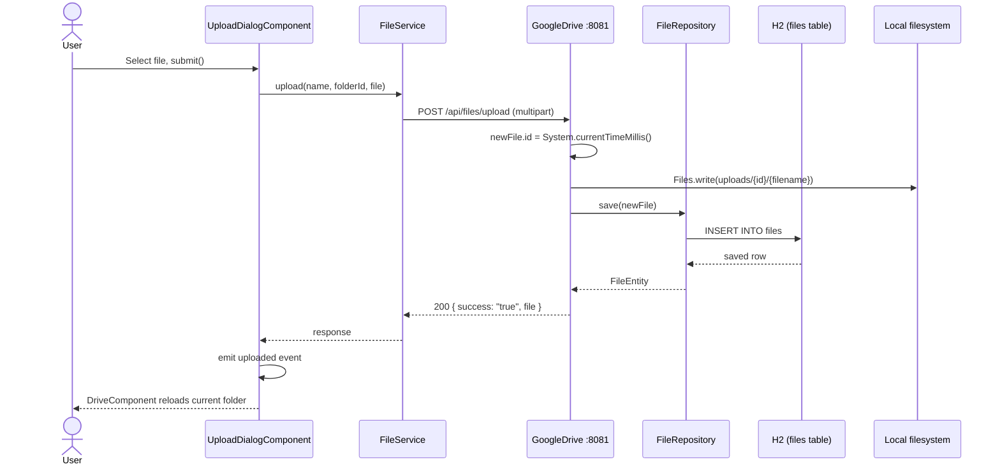
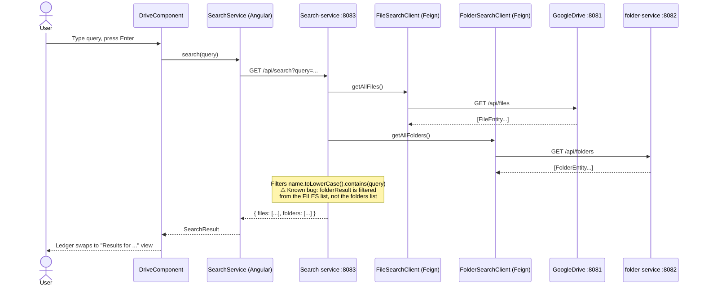
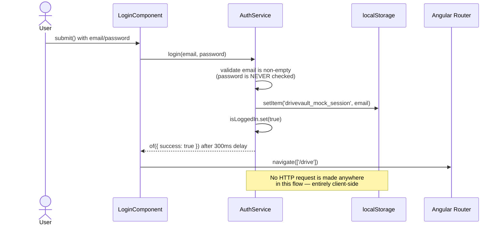
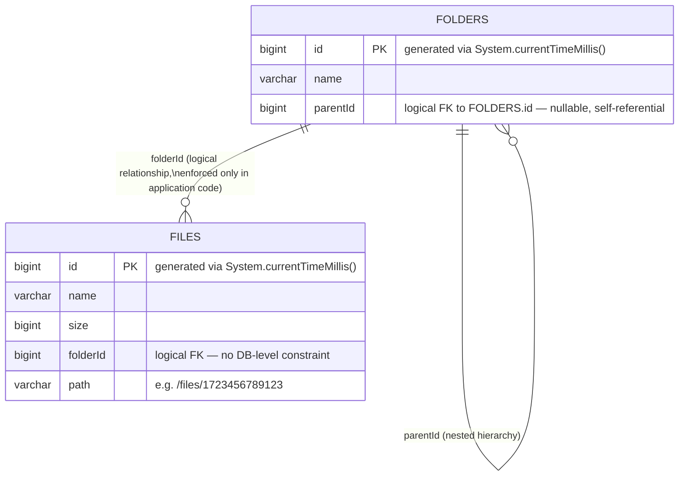
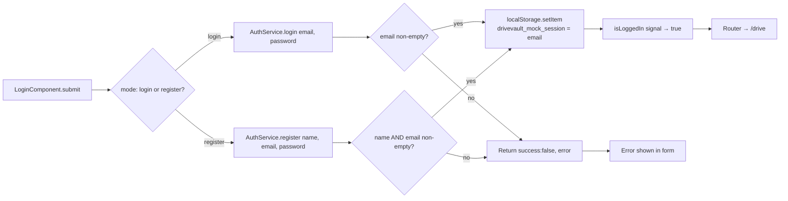

<div align="center">

# 🗄️ DriveVault

### A Google Drive–style file storage platform built on independent Java Spring Boot microservices, with an Angular 18 (standalone/signals) frontend

*"Every file, accounted for."* — DriveVault renders your files and folders as stamped entries in a bank deposit ledger.

[](https://angular.dev)
[](https://spring.io/projects/spring-boot)
[](https://openjdk.org)
[](https://www.typescriptlang.org)
[](https://maven.apache.org)
[-1B6AC6)](https://www.h2database.com)
[](https://spring.io/projects/spring-cloud-openfeign)
[](#license)

**[Repository](https://github.com/mohitpawar61/DriveVault) · [Architecture](#-system-overview) · [API Reference](#-api-documentation) · [Installation](#-installation-guide) · [Interview Guide](#-interview-guide)**

</div>

---

> **📌 Documentation note on accuracy.** Every claim in this README is drawn directly from the source in this repository (controllers, entities, `application.properties`, `pom.xml`, `package.json`, Angular services/components) as of the `master` branch. Where the project has real limitations — mocked authentication, a known bug in the combined search endpoint, no Docker/CI setup, no persistent database — they are documented plainly rather than glossed over. That honesty is itself part of what this README is meant to demonstrate in an interview setting: an engineer who can read their own system critically.

## 🖼️ Project Preview

| Screen | Description |
|---|---|
| **Sign in / Open an account** | Ledger "deposit slip" themed auth screen (mocked session) |
| **Vault (root)** | Top-level folders only — files always live one level deep |
| **Ledger view** | Breadcrumbed folder contents: sub-folders + files as ledger rows |
| **Upload dialog** | File picker with editable "display name" field |
| **Share dialog** | View/Edit permission link generator (client-side simulation) |
| **Mobile view** | Ledger rows collapse into stacked cards below the breakpoint |

*(Screenshots are not committed to the repository — add exported PNGs under `docs/screenshots/` and reference them here, e.g. ``.)*

---

## 🧭 Executive Summary

### Business Problem
Teams and individuals need a simple way to store files in a structured, navigable hierarchy — create folders, nest them, drop files inside, find things by name, and (eventually) share them — without depending on a single monolithic backend that has to be redeployed for every change to one part of the system (search, storage, folder logic).

### Business Solution
DriveVault splits that problem into three independently deployable Spring Boot microservices — **file storage**, **folder hierarchy**, and **cross-entity search** — fronted by a single Angular single-page application. Each service owns its own data and can be built, tested, versioned, and scaled independently. The Angular client composes calls to all three services into one seamless "Drive" experience.

### Target Users
- **Primary (as shipped):** a demonstration/portfolio audience — recruiters, interviewers, and other engineers evaluating microservice design, REST API design, and Angular front-end architecture.
- **Product-shape target (if productionized):** individuals or small teams needing lightweight, self-hosted cloud file storage.

### Business Value
- Demonstrates **domain-driven service decomposition** (files vs. folders vs. search are genuinely separate concerns with separate lifecycles).
- Demonstrates **synchronous service-to-service communication** using declarative REST clients (Spring Cloud OpenFeign) rather than a monolith calling its own internal methods.
- Demonstrates a **modern, zoneless-ready Angular architecture** (standalone components, signals, no NgModules) consuming multiple independent REST APIs from one client.

### Technical Highlights
- 3 independently runnable Spring Boot services, each with its own Maven build, port, and embedded H2 database.
- Declarative inter-service HTTP calls via `@FeignClient` (no manual `RestTemplate`/`WebClient` boilerplate).
- Angular 18 standalone components with **signals** for reactive local state (no NgRx/Redux — intentionally lightweight).
- A fully custom, non-templated design system ("bank vault ledger" visual identity) built from CSS custom properties — no Bootstrap/Tailwind/Material dependency.
- Resilient UX: every HTTP call surfaces a specific, actionable error message (e.g. *"Is the folder service running on port 8082?"*) instead of a silent failure.

### Major Features
| Feature | Status |
|---|---|
| Folder creation & nested hierarchy | ✅ Real (`folder-service`) |
| File upload / download / delete | ✅ Real (`GoogleDrive` service) |
| Cross-entity search (files + folders) | ✅ Real, with one known bug (`Search-service`) |
| Breadcrumb navigation | ✅ Real (computed client-side) |
| Responsive / mobile layout | ✅ Real (CSS only) |
| Sign in / Register | ⚠️ Mocked client-side (`auth.service.ts`) — no auth microservice exists |
| Share link generation | ⚠️ Mocked client-side (`share-dialog.component.ts`) — no sharing microservice exists |
| Root-level file listing | ❌ Not supported — files always require a `folderId` |

---

## 🌐 Live Demo

| Environment | URL |
|---|---|
| Frontend | Not deployed — run locally via `ng serve` at `http://localhost:4200` |
| GoogleDrive (Files API) | `http://localhost:8081` (local only) |
| folder-service (Folders API) | `http://localhost:8082` (local only) |
| Search-service (Search API) | `http://localhost:8083` (local only) |
| Swagger / OpenAPI | Not configured in any service (see [Roadmap](#-future-improvements)) |
| Source | [github.com/mohitpawar61/DriveVault](https://github.com/mohitpawar61/DriveVault) |

There is no hosted deployment in the current repository — no Dockerfile, `docker-compose.yml`, CI workflow, or cloud config exists. This is called out explicitly rather than implied, and is covered as an actionable gap in [Deployment](#-deployment) and [Future Improvements](#-future-improvements).

---

## 📑 Table of Contents

- [Executive Summary](#-executive-summary)
- [Live Demo](#-live-demo)
- [System Overview](#-system-overview)
- [Business Flow](#-business-flow)
- [Resume Highlights](#-resume-highlights)
- [ATS Keywords](#-ats-keywords)
- [Complete Technology Stack](#-complete-technology-stack)
- [Project Folder Structure](#-project-folder-structure)
- [High-Level Architecture](#-high-level-architecture)
- [Low-Level Architecture](#-low-level-architecture)
- [Component Diagram](#-component-diagram)
- [Deployment Diagram (Current State)](#-deployment-diagram-current-state)
- [Sequence Diagrams](#-sequence-diagrams)
- [ER Diagram](#-er-diagram)
- [Complete Request Lifecycle](#-complete-request-lifecycle)
- [Frontend](#-frontend)
- [Backend](#-backend)
- [Database](#-database)
- [API Documentation](#-api-documentation)
- [Authentication Flow](#-authentication-flow)
- [Frontend + Backend Integration](#-frontend--backend-integration)
- [External Integrations](#-external-integrations)
- [Configuration](#-configuration)
- [Installation Guide](#-installation-guide)
- [Docker](#-docker)
- [Deployment](#-deployment)
- [Testing](#-testing)
- [Security](#-security)
- [Logging](#-logging)
- [Performance](#-performance)
- [Challenges](#-challenges)
- [Future Improvements](#-future-improvements)
- [Troubleshooting](#-troubleshooting)
- [Interview Guide](#-interview-guide)
- [Developer Handbook](#-developer-handbook)
- [Quick Revision](#-quick-revision)
- [Explain This Project in an Interview](#-explain-this-project-in-an-interview)
- [Screenshots](#-screenshots)
- [Contributing](#-contributing)
- [License](#-license)
- [Contact](#-contact)

---

## 🏗️ System Overview



**Flow in words:** the Angular frontend never talks to a shared backend — it talks to three independent REST APIs directly, using three separate `environment.ts` base URLs. `folder-service` and `GoogleDrive` are the two systems of record (each with its own embedded H2 database). `Search-service` holds **no data of its own**; on every search request it calls the other two services live via Feign clients, then filters the combined results in memory before responding. There is no API gateway, service registry, or message broker — every dependency between services is a hardcoded `http://localhost:<port>` URL.

---

## 🔄 Business Flow



**Step-by-step narrative:**
1. **App load** — `authGuard` (a `CanActivateFn`) checks `AuthService.isLoggedIn()`, a signal seeded from a `localStorage` flag (`drivevault_mock_session`).
2. **Login/Register** — `LoginComponent` posts to the mocked `AuthService`, which requires only a non-empty email (login) or name+email (register); no password is actually validated, and no HTTP call is made.
3. **Dashboard (Vault) load** — `DriveComponent.ngOnInit()` calls `loadFolder(null)`, which fetches **all** folders from `folder-service` and filters client-side for `parentId === null` to build the root view. The root view intentionally shows **no files** — there's no "files without a folder" concept.
4. **Folder navigation** — opening a folder triggers two parallel calls: `GET /api/folders/parent/{id}` (child folders) and `GET /api/files/folder/{id}` (files in that folder), plus a client-side breadcrumb trail built by walking `parentId` pointers.
5. **Mutations** (upload, create folder, delete) each call their owning microservice directly, then call `loadFolder(currentFolderId)` again to refresh the view — there's no local cache invalidation logic beyond a full refetch.
6. **Search** calls `Search-service`, which itself calls back into `GoogleDrive` and `folder-service` via Feign, aggregates, filters, and returns a flat `{ files: [...], folders: [...] }` result rendered in place of the ledger.
7. **UI updates** are driven entirely by Angular **signals** (`signal()`/`computed()`) — there's no NgRx store, no RxJS `BehaviorSubject` state layer; component-local signals are the single source of UI truth.


---

## ⭐ Resume Highlights

Recruiter-ready bullet points, written directly from what this codebase actually does:

- Designed and implemented **DriveVault**, a Google Drive–style file storage platform decomposed into **3 independently deployable Spring Boot microservices** (file storage, folder hierarchy, search) communicating over REST and **Spring Cloud OpenFeign** declarative HTTP clients.
- Built a **file storage microservice** (Spring Boot, Spring Data JPA) supporting multipart file upload, disk-backed persistence (`uploads/{id}/{filename}`), metadata storage, and byte-stream download with correct `Content-Disposition` headers — including a **10 MB request-size limit** enforced via Spring's multipart configuration.
- Built a **folder hierarchy microservice** supporting arbitrarily nested folders via a self-referential `parentId` foreign key, with dedicated endpoints for root-level and parent-scoped folder listing.
- Built a **stateless search-aggregation microservice** that fans out to two upstream services via Feign clients, merges the results in memory, and exposes combined and entity-specific search endpoints — configured with a `Retryer.NEVER_RETRY` policy for fail-fast behavior.
- Developed the **Angular 18 frontend** using standalone components and **signals** (no NgModules, no NgRx) for a fully reactive UI without a global state management library.
- Implemented **route guards** (`CanActivateFn`) for client-side auth gating, and a **service-per-domain** Angular architecture (`FileService`, `FolderService`, `SearchService`, `AuthService`) mapped 1:1 to backend bounded contexts.
- Designed a **bespoke, non-templated design system** from scratch (custom CSS variables, no Bootstrap/Tailwind/Material) themed around a "bank vault ledger" metaphor, including responsive breakpoints and `prefers-reduced-motion` accessibility support.
- Practiced **defensive frontend error handling** — every HTTP call surfaces a specific, human-readable failure message identifying which downstream service and port is unreachable, rather than a generic toast or silent failure.
- Authored comprehensive project documentation (architecture diagrams, API reference, known-limitations register) reflecting real engineering trade-offs made under a microservices-without-infrastructure constraint (no service registry, no gateway, no message broker).
- Identified and documented a **production-grade bug** in the search aggregation logic (`SearchController.search()` filters the files list twice instead of filtering files and folders separately) — demonstrating code-review and root-cause-analysis skill.

---

## 🔑 ATS Keywords

> 💡 **Interview Tip:** These are pulled from what's genuinely present in the stack — use them in your resume/LinkedIn, but be ready to explain *how* each one is used in this specific project, since that's what the interview questions below will probe.

<details>
<summary><strong>Click to expand — 100 ATS-optimized keywords</strong></summary>

Java, Java 17, Java 21, Spring Boot, Spring Boot 3, Spring Boot 4, Spring Framework, Spring Web, Spring WebMVC, Spring Data JPA, Spring Cloud, Spring Cloud OpenFeign, Feign Client, Declarative REST Client, Hibernate, JPA, ORM, Object-Relational Mapping, H2 Database, In-Memory Database, Embedded Database, MySQL, MySQL Connector/J, Relational Database, Database Schema Design, Primary Key, Foreign Key, Self-Referential Relationship, Microservices Architecture, Microservices Design, Service Decomposition, Domain-Driven Design, Bounded Context, RESTful API, REST API Design, HTTP Methods, CRUD Operations, JSON, Multipart Form Data, File Upload, File Download, Byte Stream I/O, Content-Disposition Header, MediaType, ResponseEntity, RequestMapping, RestController, PathVariable, RequestParam, RequestBody, Cross-Origin Resource Sharing, CORS Configuration, WebMvcConfigurer, Retry Policy, Fail-Fast Design, Maven, Maven Wrapper, pom.xml, Build Automation, Dependency Management, Dependency Injection, Inversion of Control, Spring Bean, Autowired, Component Scanning, Application Properties, Externalized Configuration, Angular, Angular 18, Standalone Components, Angular Signals, Reactive Programming, RxJS, Observable, HttpClient, Angular Router, Route Guards, CanActivateFn, TypeScript, Strict Type Checking, Single Page Application, SPA Architecture, Component-Based Architecture, Service Layer Pattern, Dependency Injection (Angular), Two-Way Data Binding, Template-Driven Forms, Responsive Web Design, CSS Custom Properties, Design System, Accessibility, WCAG, Focus Management, prefers-reduced-motion, Client-Side Routing, Breadcrumb Navigation, LocalStorage, Session Management, Client-Side Validation, Error Handling, Defensive Programming, Git, GitHub, Version Control, REST Client Testing, cURL, Postman, Full Stack Development, Frontend-Backend Integration, API Consumption, Software Architecture, System Design, Distributed Systems, Inter-Service Communication, Synchronous Communication, Stateless Service, Data Aggregation

</details>


---

## 🧰 Complete Technology Stack

### Programming Languages

| Language | Where Used | Version |
|---|---|---|
| Java | `GoogleDrive`, `folder-service`, `Search-service` | 17 (GoogleDrive, Search-service) / 21 (folder-service) |
| TypeScript | Angular frontend | ~5.5 |
| HTML | Angular component templates | — |
| CSS | Component styles + global `styles.css` design tokens | — |

### Frontend

| Technology | Purpose | Why Chosen (as implemented) | Advantages | Common Alternative | Where Used |
|---|---|---|---|---|---|
| **Angular 18** | SPA framework | Standalone-components API removes NgModule boilerplate; strong TypeScript-first tooling | Batteries-included (router, forms, HTTP client), strict typing, long-term Google support | React, Vue | Entire `src/app` tree |
| **Angular Signals** | Local reactive state | Native to Angular 18, avoids pulling in a state-management library for a UI this size | Fine-grained reactivity, simpler mental model than RxJS subjects for local state | NgRx, Akita, RxJS `BehaviorSubject` | `DriveComponent`, `AuthService`, dialog components |
| **RxJS** | Async HTTP streams | Ships with `HttpClient`; used for `Observable`-based service calls | Composable async operators (`delay`, `forkJoin` imported though not yet used) | Promises, async/await | All `*.service.ts` files |
| **Angular Router** | Client-side routing | Built-in, integrates with standalone components and functional guards | Declarative route config, lazy-loading ready | React Router | `app.routes.ts` |
| **Plain CSS + CSS Custom Properties** | Styling / design system | Deliberate choice to avoid a generic dashboard-template look (per `PROMPT.md` brief) | Zero framework overhead, full control over the "ledger" visual identity | Tailwind CSS, Bootstrap, Angular Material | `styles.css` + per-component `.css` files |
| **Google Fonts (Fraunces, Inter, IBM Plex Mono)** | Typography | Display serif + humanist sans + mono, imported via CDN `@import` | Distinctive, non-templated typographic identity | System font stack | `styles.css` |

### Backend

| Technology | Purpose | Why Chosen (as implemented) | Advantages | Common Alternative | Where Used |
|---|---|---|---|---|---|
| **Spring Boot 3.5.14** | Application framework | Convention-over-configuration REST service scaffolding | Auto-configuration, embedded Tomcat, minimal boilerplate | Micronaut, Quarkus | `GoogleDrive`, `Search-service` |
| **Spring Boot 4.1.0** | Application framework | Same rationale; this service was bootstrapped separately/later, resulting in a version mismatch (see [Challenges](#-challenges)) | Same as above | — | `folder-service` |
| **Spring Web / Spring WebMVC** | REST controllers | Standard synchronous, servlet-based web layer | Mature, simple `@RestController` model | Spring WebFlux (reactive) | All three services' `controller` packages |
| **Spring Data JPA** | Persistence abstraction | Repository interfaces auto-implemented at runtime; no hand-written SQL/DAO code | Massive boilerplate reduction (`JpaRepository<T, ID>`) | MyBatis, plain JDBC, jOOQ | `FileRepository`, `FolderRepository` |
| **Hibernate** (via Spring Data JPA) | ORM | Default JPA provider bundled with Spring Boot | Entity-to-table mapping, dialect abstraction | EclipseLink | Underlies both JPA repositories |
| **Spring Cloud OpenFeign** | Declarative HTTP client | Lets `Search-service` call other services as if invoking a local interface | No manual `RestTemplate`/`WebClient` request building | `RestTemplate`, `WebClient`, plain `HttpClient` | `FileSearchClient`, `FolderSearchClient` |
| **Maven + Maven Wrapper** | Build tool | Each service ships its own `mvnw`/`mvnw.cmd` so no local Maven install is required | Reproducible builds pinned to a specific Maven version | Gradle | Root of each of the three service folders |

### Database

| Technology | Purpose | Why Chosen (as implemented) | Advantages | Common Alternative | Where Used |
|---|---|---|---|---|---|
| **H2 (in-memory)** | Runtime datastore | Zero-setup local development database (`jdbc:h2:mem:testdb`), auto-created and dropped every restart | No install, instant startup, built-in web console | SQLite | `GoogleDrive`, `folder-service` |
| **MySQL Connector/J** | Included, unused driver | Present as a `runtime` dependency in `GoogleDrive/pom.xml` so the service *can* be pointed at MySQL by editing `application.properties` — no MySQL is configured or connected today | Drop-in path to a persistent relational store | PostgreSQL driver | `GoogleDrive/pom.xml` only |

### Security

> ⚠️ **Honest status:** there is **no security dependency** (no Spring Security, no JWT library) anywhere in this repository. All three backend services expose fully open, unauthenticated REST endpoints. Frontend "authentication" is a client-only mock. This is documented in full in [Security](#-security) and [Authentication Flow](#-authentication-flow) rather than glossed over.

### Cloud / DevOps

> ⚠️ **Honest status:** no cloud provider SDKs, no Dockerfiles, no `docker-compose.yml`, and no CI/CD workflow files (e.g. `.github/workflows/`) exist in this repository. See [Docker](#-docker) and [Deployment](#-deployment) for what a productionized version would need.

### Testing

| Technology | Purpose | Where Used |
|---|---|---|
| **Spring Boot Test** (`spring-boot-starter-test`) | Available as a test-scope dependency | `GoogleDrive/pom.xml`, `Search-service/pom.xml` |
| **Spring Boot 4 test starters** (`spring-boot-starter-data-jpa-test`, `spring-boot-starter-webmvc-test`) | Available as test-scope dependencies | `folder-service/pom.xml` |
| **JUnit 5** (via the Spring Boot test starters) | Test runner | `FolderServiceApplicationTests.java` (the only test class in the repo — a context-load smoke test) |

### Build Tools

| Tool | Purpose |
|---|---|
| **Maven Wrapper (`mvnw`/`mvnw.cmd`)** | Per-service reproducible builds without a system-wide Maven install |
| **Angular CLI (`@angular/cli` 18.2)** | Frontend scaffolding, dev server, and production builds |
| **`@angular/build`** | Angular's modern esbuild-based build pipeline (`application` builder in `angular.json`) |

### Libraries (Frontend `package.json`)

| Package | Version | Role |
|---|---|---|
| `@angular/core`, `common`, `compiler`, `forms`, `platform-browser`, `platform-browser-dynamic`, `router` | ^18.2.0 | Core Angular framework packages |
| `rxjs` | ~7.8.0 | Reactive extensions for HTTP/async |
| `zone.js` | ~0.14.10 | Change-detection zone patching (Angular's default CD mechanism) |
| `tslib` | ^2.6.0 | TypeScript runtime helper library |


---

## 📁 Project Folder Structure

```text
DriveVault/                                # Repository root — ALSO the Angular project root
│
├── GoogleDrive/                           # 🗂️ File storage microservice — port 8081
│   ├── mvnw / mvnw.cmd                    # Maven Wrapper scripts (no local Maven required)
│   ├── pom.xml                            # Spring Boot 3.5.14, Java 17
│   └── src/
│       ├── main/java/com/cfs/googledrive/
│       │   ├── GoogleDriveApplication.java    # @SpringBootApplication entry point
│       │   ├── config/Config.java             # CORS: allow all origins/methods/headers
│       │   ├── controller/FileController.java # /api/files/** REST endpoints
│       │   ├── model/FileEntity.java          # @Entity mapped to `files` table
│       │   └── repository/FileRepository.java # JpaRepository<FileEntity, Long>
│       └── main/resources/
│           └── application.properties          # H2 datasource, 10MB multipart limits
│
├── folder-service/                        # 🗂️ Folder hierarchy microservice — port 8082
│   ├── mvnw / mvnw.cmd
│   ├── pom.xml                            # Spring Boot 4.1.0, Java 21 (version-mismatched vs. the other two)
│   └── src/
│       ├── main/java/com/storage/folderservice/
│       │   ├── FolderServiceApplication.java
│       │   ├── config/config.java             # CORS configuration (lowercase class name, note the inconsistency)
│       │   ├── controller/FileController.java # /api/folders/** REST endpoints (class name is a leftover misnomer)
│       │   ├── model/FolderEntity.java        # @Entity mapped to `folders` table, self-referential parentId
│       │   └── repo/FolderRepository.java     # JpaRepository<FolderEntity, Long>
│       ├── main/resources/application.properties
│       └── test/java/com/storage/folderservice/
│           └── FolderServiceApplicationTests.java  # Spring context-load smoke test
│
├── Search-service/                        # 🗂️ Search aggregation microservice — port 8083
│   ├── mvnw / mvnw.cmd
│   ├── pom.xml                            # Spring Boot 3.5.14, Java 17, Spring Cloud 2025.0.2
│   └── src/main/java/com/storage/searchservice/
│       ├── SearchServiceApplication.java  # @EnableFeignClients
│       ├── config/Config.java             # CORS + Retryer.NEVER_RETRY bean
│       ├── client/FileSearchClient.java   # @FeignClient → GoogleDrive (localhost:8081)
│       ├── client/FolderSearchClient.java # @FeignClient → folder-service (localhost:8082)
│       └── controller/SearchController.java  # /api/search/** endpoints
│
├── src/                                   # 🖥️ Angular frontend (lives at the repo ROOT, not a subfolder)
│   ├── app/
│   │   ├── components/
│   │   │   ├── login/                     # Sign in / register screen (ledger "deposit slip" theme)
│   │   │   ├── drive/                     # Main app shell: ledger table, breadcrumbs, toolbar, search
│   │   │   ├── upload-dialog/             # Upload modal — file picker + editable display name
│   │   │   ├── new-folder-dialog/         # Create-folder modal
│   │   │   └── share-dialog/              # Share-link modal (client-only simulation)
│   │   ├── services/
│   │   │   ├── auth.service.ts            # ⚠️ Mocked auth — localStorage flag, no HTTP calls
│   │   │   ├── file.service.ts            # HTTP client for GoogleDrive (8081)
│   │   │   ├── folder.service.ts          # HTTP client for folder-service (8082)
│   │   │   └── search.service.ts          # HTTP client for Search-service (8083)
│   │   ├── models/
│   │   │   ├── file-item.model.ts         # FileItem interface
│   │   │   └── folder.model.ts            # Folder interface
│   │   ├── auth.guard.ts                  # CanActivateFn route guard for /drive
│   │   ├── app.component.ts               # Root component — <router-outlet> shell
│   │   ├── app.config.ts                  # ApplicationConfig — provideRouter, provideHttpClient
│   │   └── app.routes.ts                  # Route table: /login, /drive, wildcard → /drive
│   ├── environments/
│   │   ├── environment.ts                 # Dev: explicit localhost:808x URLs per service
│   │   └── environment.prod.ts            # Prod: relative /api/* paths (assumes a reverse proxy — see Configuration)
│   ├── index.html                         # SPA shell — <app-root>
│   ├── main.ts                            # bootstrapApplication(AppComponent, appConfig)
│   └── styles.css                         # Global design tokens (colors, type, focus states, reduced-motion)
│
├── angular.json                           # Angular CLI workspace config (esbuild "application" builder)
├── package.json                           # Frontend dependencies + npm scripts (ng/start/build/watch)
├── package-lock.json                      # Locked dependency graph
├── tsconfig.json / tsconfig.app.json      # TypeScript compiler configuration (strict mode enabled)
├── README.md                              # This file's predecessor — project README (frontend + backend)
└── PROMPT.md                              # The original AI/teammate brief used to (re)generate the frontend
```

> **Note on structure vs. the prior README:** an earlier version of this repository's README referenced a `drivevault-frontend-ready/` subfolder for the Angular app. In the current `master` branch, the Angular project (`src/`, `angular.json`, `package.json`) lives directly at the **repository root**, alongside the three backend service folders. This document reflects the structure as it actually exists on disk.

### Folder-by-folder explanation

- **`GoogleDrive/`, `folder-service/`, `Search-service/`** — three fully independent Maven projects. Each has its own `pom.xml`, its own `mvnw` wrapper, and can be built/run in complete isolation from the others (aside from `Search-service`'s *runtime* dependency on the other two being reachable over HTTP).
- **`src/app/components/`** — one folder per UI feature; each component is `standalone: true` and imports exactly what it needs (`CommonModule`, `FormsModule`, and sibling components), with no shared `NgModule`.
- **`src/app/services/`** — a clean 1:1 mapping between Angular services and backend microservices (`file.service.ts` ↔ `GoogleDrive`, `folder.service.ts` ↔ `folder-service`, `search.service.ts` ↔ `Search-service`), plus one purely client-side service (`auth.service.ts`) that has no backend counterpart yet.
- **`src/environments/`** — the classic Angular dev/prod environment-file split; note that `environment.prod.ts` assumes a reverse proxy will map `/api/files`, `/api/folders`, `/api/search` to the three backend ports, since it does **not** hardcode `localhost` URLs the way the dev environment does.


---

## 🏛️ High-Level Architecture



---

## 🔬 Low-Level Architecture

```mermaid
graph LR
    subgraph GoogleDrive["GoogleDrive Service (com.cfs.googledrive)"]
        direction TB
        GDC[FileController<br/>@RestController]
        GDR[FileRepository<br/>extends JpaRepository]
        GDE[FileEntity<br/>@Entity table=files]
        GDCfg[Config<br/>CORS WebMvcConfigurer]
        GDC --> GDR --> GDE
    end

    subgraph FolderService["folder-service (com.storage.folderservice)"]
        direction TB
        FSC[FileController<br/>@RestController]
        FSR[FolderRepository<br/>extends JpaRepository]
        FSE[FolderEntity<br/>@Entity table=folders]
        FSCfg[config<br/>CORS WebMvcConfigurer]
        FSC --> FSR --> FSE
    end

    subgraph SearchService["Search-service (com.storage.searchservice)"]
        direction TB
        SSC[SearchController<br/>@RestController]
        SFC[FileSearchClient<br/>@FeignClient]
        SFOC[FolderSearchClient<br/>@FeignClient]
        SCfg[Config<br/>CORS + Retryer.NEVER_RETRY]
        SSC --> SFC
        SSC --> SFOC
    end

    SFC -.HTTP GET.-> GDC
    SFOC -.HTTP GET.-> FSC
```

---

## 🧩 Component Diagram



---

## 🚀 Deployment Diagram (Current State)



> There is no containerized or cloud deployment topology in the current repository — this diagram reflects the **only environment the project actually supports today**: four processes on one machine, on four hardcoded ports. See [Docker](#-docker) and [Deployment](#-deployment) for what would need to be added to run this anywhere else.


---

## ⏱️ Sequence Diagrams

### 1. Upload a file



### 2. Search across files and folders



### 3. Login (mocked)



---

## 🗃️ ER Diagram



> **Important architectural note:** `FILES.folderId` and `FOLDERS.parentId` are **not** real database foreign keys — they are plain `Long` columns. Because `files` lives in `GoogleDrive`'s own H2 database and `folders` lives in `folder-service`'s **separate** H2 database, a true relational foreign-key constraint is impossible across service boundaries — this is a standard, expected trade-off of the "database per service" microservices pattern (referential integrity becomes an application-level, not database-level, concern).


---

## 🔁 Complete Request Lifecycle

Example: **user opens a folder** (`GET /api/folders/parent/{id}` + `GET /api/files/folder/{id}`)

```
Browser (user clicks a folder row)
   ↓
Angular Router  — already on /drive, no navigation needed (SPA, single route)
   ↓
DriveComponent.openFolder(folder) → loadFolder(folder.id)
   ↓
FolderService.getByParent(id) & FileService.getByFolder(id)  ← Angular services, HttpClient
   ↓
HTTP GET http://localhost:8082/api/folders/parent/{id}
HTTP GET http://localhost:8081/api/files/folder/{id}
   ↓
Spring DispatcherServlet routes each request to its @RestController
   ↓
folder-service: FileController.getFolderByParent(parentId)
GoogleDrive:     FileController.getFilesByFolder(folderId)
   ↓
(No validation layer / DTOs — the @PathVariable is passed straight through)
   ↓
FolderRepository.findByParentId(parentId)   — Spring Data JPA derived query
FileRepository.findByFolderId(folderId)     — Spring Data JPA derived query
   ↓
Hibernate translates to SQL SELECT ... WHERE parent_id = ? / folder_id = ?
   ↓
H2 in-memory database executes the query, returns rows
   ↓
Hibernate maps ResultSet rows → FolderEntity / FileEntity Java objects
   ↓
Repository returns List<FolderEntity> / List<FileEntity>
   ↓
Controller returns the list directly — Spring's Jackson HttpMessageConverter
serializes it to a JSON array automatically (no explicit DTO mapping step)
   ↓
HTTP 200 response, Content-Type: application/json, back across the network
   ↓
Angular HttpClient parses JSON into typed Folder[] / FileItem[] (interfaces,
not runtime-validated — TypeScript types are compile-time only)
   ↓
DriveComponent sets childFolders() and files() signals
   ↓
Angular's change detection re-renders drive.component.html
   ↓
Browser paints the updated ledger table (folders + files for that location)
```

**Step-by-step explanation:**
1. **Browser → Router**: this app is a single functional route (`/drive`) for the whole authenticated experience, so "routing" here is really just component-internal state change, not a URL navigation.
2. **Component → Service**: `DriveComponent` never calls `HttpClient` directly — it always goes through a domain service (`FolderService`, `FileService`), keeping HTTP concerns out of the component.
3. **Service → Controller**: no API gateway or load balancer sits in between; the Angular service holds the literal `http://localhost:808x` base URL from `environment.ts`.
4. **Controller → Repository**: there is **no service layer** in any of the three backends — controllers call `JpaRepository` methods directly. This is a real, notable architectural simplification worth naming in an interview (see [Interview Guide](#-interview-guide)).
5. **Repository → Database**: Spring Data JPA derives the SQL from the method name (`findByParentId`, `findByFolderId`) — no `@Query` annotations or native SQL anywhere in the repo.
6. **Response → Frontend**: entities are serialized and returned as-is; there are **no DTOs** anywhere in the backend, so the wire format is the JPA entity shape directly (a common shortcut in small/demo services, and a real coupling risk in production).
7. **Frontend → UI**: signals (`childFolders`, `files`) are updated, and Angular's fine-grained reactivity re-renders only the parts of the template that read those signals.


---

## 🖥️ Frontend

### Application Startup
`main.ts` calls `bootstrapApplication(AppComponent, appConfig)` — the Angular 18 standalone bootstrap API (no `platformBrowserDynamic().bootstrapModule(AppModule)`, no `NgModule` anywhere in the app). `appConfig` (in `app.config.ts`) registers exactly two providers: `provideRouter(routes)` and `provideHttpClient()`.

### Routing
Defined in `app.routes.ts` as a flat `Routes` array — **not** a lazy-loaded route tree:

| Path | Component | Guard |
|---|---|---|
| `/login` | `LoginComponent` | none |
| `/drive` | `DriveComponent` | `authGuard` |
| `''` (empty) | redirects to `/drive` | — |
| `**` (wildcard) | redirects to `/drive` | — |

### Layouts
There is no dedicated shared layout/shell component beyond `AppComponent`'s bare `<router-outlet>`. `DriveComponent`'s own template (`drive.component.html`) contains the top bar, search field, breadcrumb toolbar, and ledger — it functions as both page and layout in one.

### Components
| Component | Responsibility | Inputs/Outputs |
|---|---|---|
| `LoginComponent` | Sign in / register form, tab-toggle between modes | none (top-level, routed) |
| `DriveComponent` | Main app shell: loads/derives folder + file state, breadcrumbs, search, delegates to dialogs | none (top-level, routed) |
| `UploadDialogComponent` | File picker + upload trigger | `@Input folderId`, `@Output closed`, `@Output uploaded` |
| `NewFolderDialogComponent` | Folder name input + create trigger | `@Input parentId`, `@Output closed`, `@Output created` |
| `ShareDialogComponent` | Generates and copies a mock share link | `@Input target: ShareTarget`, `@Output closed` |

### Pages
Functionally there are two "pages": the auth page (`/login`) and the drive page (`/drive`). Dialogs are rendered conditionally inside `DriveComponent`'s template via signal-driven `*ngIf`s (`showUpload()`, `showNewFolder()`, `shareTarget()`), not as separate routes or a router-outlet-based modal system.

### Hooks / Lifecycle
`DriveComponent` implements `OnInit` and calls `loadFolder(null)` on init to populate the root view. `ShareDialogComponent` implements `OnInit` to eagerly generate a mock link as soon as it's opened. No other Angular lifecycle hooks (`OnDestroy`, `OnChanges`, etc.) are used in the codebase.

### State Management
State is entirely **local, per-component, signal-based** (`signal()` / `computed()`):
- `DriveComponent` holds `currentFolderId`, `trail`, `allFolders`, `childFolders`, `files`, `loading`, `errorMsg`, `searchResults`, dialog-visibility signals, and `shareTarget` — all as independent signals, no single combined state object.
- `isRoot` is a `computed()` signal derived from `currentFolderId() === null`.
- There is **no Context API equivalent, no NgRx, no Akita, no global store** — every service is `providedIn: 'root'` (a singleton), but the *data* they return is not cached at the service layer; `DriveComponent` re-fetches on every navigation.

### Context / Redux
Not used. This is a deliberate simplification appropriate to the app's size — worth being able to explain the trade-off in an interview (see [Interview Guide](#-interview-guide)).

### API Calls
All HTTP access goes through `HttpClient`, injected into each domain service via constructor injection, and always returns typed `Observable<T>`s consumed via `.subscribe({ next, error })` — no `async`/`await` with `firstValueFrom`/`lastValueFrom`, and no use of the `AsyncPipe` in templates (values are pulled into signals inside the `next` callback instead).

### Authentication (Frontend Side)
See the dedicated [Authentication Flow](#-authentication-flow) section — implemented entirely in `auth.service.ts` with no backend calls.

### Protected Routes
`/drive` is the only protected route, gated by `authGuard` (`CanActivateFn`), which redirects unauthenticated users to `/login`.

### Forms
Both the login/register form and the two creation dialogs use **template-driven forms** (`FormsModule` + `[(ngModel)]` + `#f="ngForm"`), not Angular Reactive Forms (`FormGroup`/`FormBuilder`).

### Validation
Validation is minimal and HTML5/template-driven: `required` attributes on inputs, plus a couple of hand-written guard clauses in component methods (e.g. `NewFolderDialogComponent.submit()` checks `!this.name.trim()` before calling the service). There is no schema-based validation library (no Zod, no Angular Reactive Forms validators beyond `required`).

### Responsive Design
The ledger table is designed to collapse into stacked cards below a mobile breakpoint (per `styles.css` / `drive.component.css` media queries), and the design brief (`PROMPT.md`) explicitly calls for usability "down to mobile widths."

### Reusable Components
The three dialogs (`UploadDialogComponent`, `NewFolderDialogComponent`, `ShareDialogComponent`) are the primary reusable/composable units, each self-contained with its own template, styles, and service dependency, communicating with the parent purely via `@Input`/`@Output`.

### Assets
No `src/assets/` folder or bundled image assets exist; `angular.json`'s `assets` array is empty. All visual identity comes from CSS (colors, typography, a "DV" text mark) rather than image files. `index.html` references a `favicon.ico` that is not present in the repository.

### Styling
A single global `styles.css` defines CSS custom properties (`--ink`, `--paper`, `--vault`, `--stamp`, etc.), base element resets, `.btn`/`.btn-secondary`/`.btn-danger` utility classes, and accessibility rules; each component additionally has its own scoped `.css` file for component-specific layout.

### Dark Mode
Not implemented — the design system defines a single light "paper ledger" palette only.


---

## ⚙️ Backend

### Spring Boot Startup
Each service has its own `@SpringBootApplication`-annotated class with a single-line `main()` calling `SpringApplication.run(...)`: `GoogleDriveApplication`, `FolderServiceApplication`, `SearchServiceApplication`. `SearchServiceApplication` additionally carries `@EnableFeignClients` to activate Feign client proxy generation for its `client` package.

### Dependency Injection
All three services use standard Spring **constructor-less field injection** via `@Autowired` (e.g. `@Autowired private FileRepository fileRepository;` in `GoogleDrive`'s `FileController`) rather than constructor injection — a common style choice, though constructor injection is generally considered the more testable/idiomatic modern practice (a good talking point in an interview).

### Beans
Each service defines its CORS policy as an implicit bean via `@Configuration` classes implementing `WebMvcConfigurer` (`Config`/`config` classes). `Search-service`'s `Config` additionally exposes an explicit `@Bean public Retryer feignRetryer()` returning `Retryer.NEVER_RETRY`, overriding Feign's default retry behavior so a failed call to `GoogleDrive` or `folder-service` fails immediately rather than retrying.

### Configuration
Configuration is entirely via `application.properties` per service (no `application.yml`, no Spring Profiles, no `@ConfigurationProperties` classes). See the [Configuration](#-configuration) section for every property.

### Controllers
| Service | Controller Class | Base Path |
|---|---|---|
| GoogleDrive | `FileController` | `/api/files` |
| folder-service | `FileController` *(class name is a carryover/misnomer — it actually handles folders)* | `/api/folders` |
| Search-service | `SearchController` | `/api/search` |

All controllers are annotated `@RestController` (JSON responses by default, no separate `@ResponseBody` needed) and use `@RequestMapping` at the class level with method-level `@GetMapping`/`@PostMapping`/`@DeleteMapping`.

### Services
⚠️ **There is no service layer in this codebase.** All three controllers call their `JpaRepository` (or Feign client) directly — no intermediate `@Service`-annotated class exists anywhere in the three microservices. This is a real, nameable architectural simplification (see [Interview Guide](#-interview-guide) for how to discuss it).

### Repositories
| Interface | Extends | Custom Query Methods |
|---|---|---|
| `FileRepository` | `JpaRepository<FileEntity, Long>` | `List<FileEntity> findByFolderId(Long folderId)` |
| `FolderRepository` | `JpaRepository<FolderEntity, Long>` | `List<FolderEntity> findByParentId(Long parentId)` |

Both custom methods are **Spring Data JPA derived queries** — the SQL is generated purely from the method name, with zero `@Query` annotations anywhere in the project.

### Entities
| Entity | Table | Fields |
|---|---|---|
| `FileEntity` | `files` | `id` (`@Id`, `Long`), `name` (`String`), `size` (`Long`), `folderId` (`Long`), `path` (`String`) |
| `FolderEntity` | `folders` | `id` (`@Id`, `Long`), `name` (`String`), `parentId` (`Long`, nullable) |

Neither entity uses `@GeneratedValue` — IDs are assigned manually in the controller via `System.currentTimeMillis()` before `save()` is called (see [Known Limitations](#-challenges)).

### DTOs
⚠️ **None exist.** JPA entities are returned directly from controllers (`GoogleDrive`'s `getAllFiles()` returns `List<FileEntity>` straight from the repository) and accepted directly as `@RequestBody` in some endpoints (`folder-service`'s `POST /api/folders` takes a raw `FolderEntity`). The two "create" endpoints that *do* use a different input shape (`POST /api/files/upload`, `POST /api/folders/create`) use raw `Map<String, Object>`/`@RequestParam` combinations rather than typed request DTOs.

### Validation
No `@Valid`/`@NotNull`/Bean Validation annotations exist anywhere in the three services. The only "validation" present is manual null/empty checks inside `try/catch` blocks in the two `/create`-style endpoints, and Spring's own multipart size enforcement (`10MB`) in `GoogleDrive`.

### Security
No Spring Security dependency, no authentication filter, no authorization checks — every endpoint on every service is fully open. See [Security](#-security) for the full picture and what a real implementation would require.

### Exception Handling
No `@ControllerAdvice`/`@ExceptionHandler` classes exist anywhere. Error handling is done inline:
- `GoogleDrive.uploadFile()` wraps its logic in a `try/catch` and returns a `Map` with an `error` key on failure (still a `200 OK` HTTP status, not a `4xx`/`5xx` — a real API-design gap worth naming).
- `folder-service.createNewFolder()` does the same pattern.
- `GoogleDrive.downloadFile()` returns `ResponseEntity.noContent()` (204) if the file/metadata is missing, and `ResponseEntity.internalServerError()` (500) with a message string on I/O failure.
- All other endpoints (e.g. `getFile`, `getFolder`) simply return `null` via `.orElse(null)` if the ID doesn't exist, which Spring serializes as an HTTP 200 with a JSON `null` body rather than a proper 404.

### Logging
Only `GoogleDrive/application.properties` sets an explicit log level (`logging.level.root=INFO`); the other two services rely entirely on Spring Boot's default logging configuration (Logback, INFO root level, console appender). No structured logging, no log aggregation, and no request/response logging filters are configured anywhere.

### Transactions
No explicit `@Transactional` annotations exist anywhere in the codebase. Each repository call (`save`, `deleteById`, `findBy...`) runs in Spring Data JPA's own default per-method transaction boundary, which is sufficient here since no operation spans multiple repository calls within a single request.


---

## 🗄️ Database

DriveVault follows the **database-per-service** microservices pattern: `GoogleDrive` and `folder-service` each run their own embedded, isolated **H2 in-memory** database — they do not share a schema, a connection pool, or even a running database process. `Search-service` has no database at all.

### `files` table (owned by `GoogleDrive`)

| Column | Type | Constraints | Notes |
|---|---|---|---|
| `id` | `BIGINT` | Primary Key | Assigned in application code via `System.currentTimeMillis()`, **not** DB auto-increment |
| `name` | `VARCHAR` | — | Original uploaded filename (or the caller-supplied `name` if the browser sends no filename) |
| `size` | `BIGINT` | — | File size in bytes, captured from `MultipartFile.getSize()` |
| `folder_id` | `BIGINT` | — (no FK constraint) | Logical link to a folder owned by a *different* service/database |
| `path` | `VARCHAR` | — | Virtual path string, always `"/files/" + id"` |

### `folders` table (owned by `folder-service`)

| Column | Type | Constraints | Notes |
|---|---|---|---|
| `id` | `BIGINT` | Primary Key | Assigned via `System.currentTimeMillis()` |
| `name` | `VARCHAR` | — | Folder display name |
| `parent_id` | `BIGINT` | — (nullable, no FK constraint) | `NULL` = root-level folder; otherwise points to another row's `id` in the same table |

### Relationships
- **`folders.parent_id → folders.id`** — a self-referential one-to-many (a folder has many child folders), forming the nested hierarchy walked client-side in `DriveComponent.buildTrail()`.
- **`files.folder_id → folders.id`** — a cross-database logical relationship. Because it crosses a service/database boundary, it is enforced **only in application code**, never at the database level — a textbook, expected microservices trade-off (see the ER diagram note above).

### Indexes
No explicit `@Index`/`@Table(indexes = ...)` annotations exist. Hibernate creates a default primary-key index on `id` for both tables via `spring.jpa.hibernate.ddl-auto=create-drop`; `folder_id` and `parent_id` are **not** indexed, which would matter for query performance at scale (both `findByFolderId` and `findByParentId` would perform full table scans on a non-trivial dataset — a good performance talking point).

### Constraints
No `NOT NULL`, `UNIQUE`, `CHECK`, or foreign-key constraints are declared on any column beyond the implicit primary key.

### Sample Data
No seed data, `data.sql`, or `@PostConstruct` data loader exists — both databases start completely empty on every service restart (`ddl-auto=create-drop` drops and recreates the schema each time).

### Optimization
None implemented (no connection pool tuning beyond Spring Boot's HikariCP defaults, no query caching, no indexing strategy). This is appropriate for a demo-scale, in-memory database, and is explicitly named as a production gap in [Performance](#-performance).


---

## 📡 API Documentation

> No Swagger/OpenAPI (`springdoc-openapi`) dependency exists in any `pom.xml`, so there is no auto-generated interactive API doc — this section **is** the API reference. All endpoints are unauthenticated (see [Security](#-security)).

### GoogleDrive Service — `http://localhost:8081`

#### `GET /api/files`
| | |
|---|---|
| **Purpose** | List every file across all folders |
| **Auth** | None |
| **Headers** | None required |
| **Request Body** | None |
| **Validation** | None |
| **Response** | `200 OK` — JSON array of `FileEntity` |
| **Status Codes** | `200` always (even if empty) |
| **Related Service/Repo** | `FileController.getAllFiles()` → `FileRepository.findAll()` |
| **Frontend Caller** | `FileService.getAll()` (defined, not currently called by any component) |

```bash
curl http://localhost:8081/api/files
```

#### `GET /api/files/{id}`
| | |
|---|---|
| **Purpose** | Fetch a single file's metadata |
| **Response** | `200 OK` with the `FileEntity`, or `200 OK` with JSON `null` if not found (⚠️ not a `404`) |
| **Related Service/Repo** | `FileController.getFile()` → `FileRepository.findById(id).orElse(null)` |
| **Frontend Caller** | Not called from the current UI |

```bash
curl http://localhost:8081/api/files/1723456789123
```

#### `GET /api/files/folder/{folderId}`
| | |
|---|---|
| **Purpose** | List all files inside a specific folder |
| **Response** | `200 OK` — JSON array of `FileEntity` |
| **Related Service/Repo** | `FileController.getFilesByFolder()` → `FileRepository.findByFolderId()` |
| **Frontend Caller** | `FileService.getByFolder(folderId)`, called from `DriveComponent.loadFolder()` |

```bash
curl http://localhost:8081/api/files/folder/1723456789000
```

#### `POST /api/files/upload`
| | |
|---|---|
| **Purpose** | Upload a new file into a folder |
| **Headers** | `Content-Type: multipart/form-data` (set automatically by the browser/`FormData`) |
| **Request** | Multipart fields: `name` (string), `folderId` (long), `file` (binary) |
| **Validation** | None explicit — wrapped in try/catch; a missing/invalid `folderId` throws and is caught, returning an error map with **HTTP 200** |
| **Response (success)** | `{ "success": "true", "file": { id, name, size, folderId, path } }` |
| **Response (failure)** | `{ "Success": false, "error": "<exception message>" }` — ⚠️ note the inconsistent casing of `success`/`Success` between the two branches |
| **Max Size** | 10 MB per file/request (`spring.servlet.multipart.max-file-size` / `max-request-size`) |
| **Related Service/Repo** | `FileController.uploadFile()` → writes to disk via `Files.write()`, then `FileRepository.save()` |
| **Frontend Caller** | `FileService.upload()`, from `UploadDialogComponent.submit()` |

```bash
curl -X POST http://localhost:8081/api/files/upload \
  -F "name=resume.pdf" \
  -F "folderId=1723456789000" \
  -F "file=@/path/to/resume.pdf"
```

#### `GET /api/files/download/{id}`
| | |
|---|---|
| **Purpose** | Download the raw bytes of a file |
| **Response Headers** | `Content-Disposition: attachment; filename="<name>"`, `Content-Type: application/octet-stream`, `Content-Length` |
| **Status Codes** | `200` with body on success · `204 No Content` if the file record or the on-disk file is missing · `500` with an error string on `IOException` |
| **Related Service/Repo** | `FileController.downloadFile()` — reads `uploads/{id}/{filename}` from disk |
| **Frontend Caller** | `FileService.download(id)` (returns a `Blob`), from `DriveComponent.downloadFile()`, which creates an `<a download>` element client-side |

```bash
curl -OJ http://localhost:8081/api/files/download/1723456789123
```

#### `DELETE /api/files/{id}`
| | |
|---|---|
| **Purpose** | Delete a file's metadata row (⚠️ does **not** delete the physical file from `uploads/`) |
| **Response** | `200 OK`, empty body |
| **Related Service/Repo** | `FileController.deleteFile()` → `FileRepository.deleteById()` |
| **Frontend Caller** | `FileService.delete(id)`, from `DriveComponent.deleteFile()` (guarded by a `confirm()` dialog) |

```bash
curl -X DELETE http://localhost:8081/api/files/1723456789123
```

---

### folder-service — `http://localhost:8082`

#### `GET /api/folders`
| | |
|---|---|
| **Purpose** | List every folder in the system |
| **Response** | `200 OK` — JSON array of `FolderEntity` |
| **Related Service/Repo** | `FileController.getAllFolders()` → `FolderRepository.findAll()` |
| **Frontend Caller** | `FolderService.getAll()`, called on every `DriveComponent.loadFolder()` to rebuild breadcrumbs and the root view |

```bash
curl http://localhost:8082/api/folders
```

#### `GET /api/folders/{id}`
| | |
|---|---|
| **Purpose** | Fetch a single folder by ID |
| **Response** | `200 OK` with the entity, or `null` body if not found |
| **Related Service/Repo** | `FileController.getFolder()` → `FolderRepository.findById(id).orElse(null)` |
| **Frontend Caller** | `FolderService.getById(id)` (defined, not currently called from the UI) |

```bash
curl http://localhost:8082/api/folders/1723456789000
```

#### `GET /api/folders/parent/{parentId}`
| | |
|---|---|
| **Purpose** | List direct child folders of a given parent |
| **Response** | `200 OK` — JSON array of `FolderEntity` |
| **Related Service/Repo** | `FileController.getFolderByParent()` → `FolderRepository.findByParentId()` |
| **Frontend Caller** | `FolderService.getByParent(id)`, from `DriveComponent.loadFolder()` when navigating into a folder |

```bash
curl http://localhost:8082/api/folders/parent/1723456789000
```

#### `POST /api/folders`
| | |
|---|---|
| **Purpose** | Create a folder by accepting a raw `FolderEntity` JSON body |
| **Request** | `{ "id": <long>, "name": "...", "parentId": <long|null> }` — ⚠️ the caller must supply an `id`, since this endpoint performs no ID generation |
| **Response** | `200 OK` with the saved `FolderEntity` |
| **Related Service/Repo** | `FileController.createFolder()` → `FolderRepository.save()` |
| **Frontend Caller** | None — the frontend exclusively uses `/api/folders/create` below |

```bash
curl -X POST http://localhost:8082/api/folders \
  -H "Content-Type: application/json" \
  -d '{"id": 1723456789999, "name": "Legacy", "parentId": null}'
```

#### `POST /api/folders/create` *(the endpoint the frontend actually uses)*
| | |
|---|---|
| **Purpose** | Create a folder with a server-generated ID |
| **Request** | `{ "name": "...", "parentId": <long|null> }` |
| **Validation** | None explicit; wrapped in try/catch |
| **Response (success)** | `{ "Success": true, "folder": { id, name, parentId } }` |
| **Response (failure)** | `{ "Success": false, "error": "<message>" }` — still **HTTP 200** |
| **Related Service/Repo** | `FileController.createNewFolder()` → assigns `id = System.currentTimeMillis()`, then `FolderRepository.save()` |
| **Frontend Caller** | `FolderService.create(name, parentId)`, from `NewFolderDialogComponent.submit()` |

```bash
curl -X POST http://localhost:8082/api/folders/create \
  -H "Content-Type: application/json" \
  -d '{"name": "Photos", "parentId": null}'
```

#### `DELETE /api/folders/{id}`
| | |
|---|---|
| **Purpose** | Delete a folder row |
| **⚠️ Note** | Deleting a folder does **not** cascade-delete its child folders or the files inside it (no cascade logic in application code or DB) — orphaned rows can result |
| **Response** | `200 OK`, empty body |
| **Related Service/Repo** | `FileController.deleteFolder()` → `FolderRepository.deleteById()` |
| **Frontend Caller** | `FolderService.delete(id)`, from `DriveComponent.deleteFolder()` (guarded by `confirm()`) |

```bash
curl -X DELETE http://localhost:8082/api/folders/1723456789000
```

---

### Search-service — `http://localhost:8083`

> Search-service requires **both `GoogleDrive` (8081) and `folder-service` (8082) to be running and reachable**, since every request fetches live data from them via Feign (`Retryer.NEVER_RETRY` means a single failed downstream call fails the whole request immediately, with no automatic retry).

#### `GET /api/search?query={text}`
| | |
|---|---|
| **Purpose** | Combined search across both files and folders |
| **Response** | `{ "files": [...], "folders": [...] }` |
| **⚠️ Known Bug** | `SearchController.search()` filters the **files** list into both `fileResult` *and* `folderResult` (a copy-paste error — it should filter `allFolders`, not `allFiles`, for the second list). In practice, the `folders` array in this endpoint's response currently returns filtered **files**, not folders. Use the two dedicated endpoints below for guaranteed-correct results per entity type. |
| **Related Service/Repo** | `SearchController.search()` → `FileSearchClient.getAllFiles()` + `FolderSearchClient.getAllFolders()` |
| **Frontend Caller** | `SearchService.search(query)`, from `DriveComponent.runSearch()` |

```bash
curl "http://localhost:8083/api/search?query=resume"
```

#### `GET /api/search/files?query={text}`
| | |
|---|---|
| **Purpose** | Search files only (correct, bug-free implementation) |
| **Response** | JSON array of matching file maps |
| **Related Service/Repo** | `SearchController.searchFiles()` → `FileSearchClient.getAllFiles()`, filtered in-memory |
| **Frontend Caller** | Not currently called from the UI (the UI uses the combined endpoint) |

```bash
curl "http://localhost:8083/api/search/files?query=resume"
```

#### `GET /api/search/folders?query={text}`
| | |
|---|---|
| **Purpose** | Search folders only (correct, bug-free implementation) |
| **Response** | JSON array of matching folder maps |
| **Related Service/Repo** | `SearchController.searchFolder()` → `FolderSearchClient.getAllFolders()`, filtered in-memory |
| **Frontend Caller** | Not currently called from the UI |

```bash
curl "http://localhost:8083/api/search/folders?query=photos"
```

**Matching logic (all three endpoints):** case-insensitive substring match — `name.toLowerCase().contains(query.toLowerCase())`. No relevance ranking, no prefix/fuzzy matching, no pagination.


---

## 🔐 Authentication Flow

> ⚠️ **This is the single most important thing to be upfront about in an interview.** There is no auth microservice, no JWT, no session cookie, and no server-side credential check anywhere in this repository. Everything below happens **entirely inside the Angular app, in memory and in `localStorage`.**



- **Frontend Login** — `LoginComponent` collects email/password (or name/email/password for register) via template-driven forms and calls `AuthService`.
- **"JWT"** — none exists. No token is issued, stored, or attached to any request. `FileService`, `FolderService`, and `SearchService` send **no** `Authorization` header at all.
- **Spring Security** — not a dependency in any of the three `pom.xml` files.
- **Authentication Filter** — none; every backend endpoint is reachable by anyone who can reach the port.
- **Authorization / Role-Based Access** — not implemented; there is no concept of a "user" on the backend at all (no `User` entity, no ownership field on `FileEntity`/`FolderEntity`).
- **Protected Routes** — enforced only client-side, by `authGuard` checking a `localStorage` flag. This can trivially be bypassed by setting `localStorage.setItem('drivevault_mock_session', 'anything')` in the browser console — it provides **zero real security**, only a UX gate.
- **Logout** — `AuthService.logout()` removes the `localStorage` key and flips `isLoggedIn` to `false`; `DriveComponent.logout()` calls this and navigates to `/login`.
- **Token Validation** — not applicable; there is no token.

**What a real implementation would need** (see also [Future Improvements](#-future-improvements)): a dedicated `auth-service` issuing JWTs on login, Spring Security resource-server configuration on each of the three existing services to validate that JWT on every request, an `Authorization: Bearer <token>` interceptor added to Angular's `HttpClient` pipeline, and a `userId`/`ownerId` column added to both `FileEntity` and `FolderEntity` so data can actually be scoped per user.

---

## 🔗 Frontend + Backend Integration

- **HTTP Client** — Angular's built-in `HttpClient` (via `provideHttpClient()`), not Axios or `fetch` directly.
- **Base URLs** — three separate base URLs, one per service, defined in `src/environments/environment.ts` (dev) and `environment.prod.ts` (prod):

  | Service | Dev URL | Prod URL |
  |---|---|---|
  | Files | `http://localhost:8081/api/files` | `/api/files` (relative — assumes a reverse proxy) |
  | Folders | `http://localhost:8082/api/folders` | `/api/folders` |
  | Search | `http://localhost:8083/api/search` | `/api/search` |

- **CORS** — each of the three Spring Boot services independently registers a permissive `WebMvcConfigurer` CORS mapping (`allowedOriginPatterns("*")`, `GET/POST/PUT/DELETE`, `allowCredentials(true)`) — convenient for local development, but must be tightened before any real deployment (see [Security](#-security)).
- **Authentication Headers** — none are sent; see [Authentication Flow](#-authentication-flow) above.
- **Token Storage** — N/A (no token). A plain email string is stored under `localStorage['drivevault_mock_session']` purely to gate the route guard.
- **Error Handling** — each Angular service call is wrapped by the calling component with an explicit `error:` callback in `.subscribe({...})` that sets a signal (`errorMsg`), which the template renders as a visible banner — e.g. *"Could not reach the folder service. Is it running on port 8082?"* This pattern is repeated consistently across `DriveComponent`, `UploadDialogComponent`, and `NewFolderDialogComponent`.
- **Loading States** — tracked via boolean signals (`loading`, `uploading`, `creating`, `searching`) toggled at the start/end of each request, used to disable buttons and show "Please wait…"-style text.
- **Retry Logic** — none on the Angular side. On the backend, only `Search-service`'s Feign clients have an explicit (disabled) retry policy — `Retryer.NEVER_RETRY` — meaning a transient failure calling `GoogleDrive` or `folder-service` is **not** retried and immediately surfaces as an error.
- **Response Parsing** — `HttpClient` auto-parses JSON responses into the generic type parameter given at the call site (`Observable<FileItem[]>`, `Observable<Folder[]>`, etc.); this is a compile-time-only guarantee — there's no runtime schema validation of what the backend actually returns.

---

## 🔌 External Integrations

Only integrations **actually present in the code** are listed — nothing here is inferred or aspirational.

| Integration | Present? | Details |
|---|---|---|
| Google Fonts (CDN) | ✅ Yes | `styles.css` imports Fraunces, Inter, and IBM Plex Mono via `fonts.googleapis.com` |
| Spring Cloud OpenFeign | ✅ Yes | Declarative inter-service HTTP calls, `Search-service` → `GoogleDrive` / `folder-service` |
| H2 Database | ✅ Yes | Embedded, in-memory, per-service |
| MySQL Connector/J | ⚠️ Partial | Present as a dependency in `GoogleDrive/pom.xml`, but no MySQL connection is configured — it's an unused, ready-to-activate driver |
| Kafka | ❌ No | Not present |
| Redis | ❌ No | Not present |
| Spring AI / Gemini / OpenAI | ❌ No | Not present |
| SMTP / Email | ❌ No | Not present |
| Cloudinary | ❌ No | Not present |
| Google Drive API (the real one) | ❌ No | Despite the project's name and theme, no actual Google Drive/Google OAuth integration exists — `GoogleDrive` is only the name of the file-storage microservice, which stores files on the **local disk**, not in Google's cloud |
| Razorpay | ❌ No | Not present |
| Swagger / OpenAPI | ❌ No | Not present |
| Apache Tika | ❌ No | Not present |
| JWT | ❌ No | Not present |
| Docker | ❌ No | Not present |


---

## 🛠️ Configuration

### `package.json` (frontend, repo root)
Scripts: `ng` (raw CLI passthrough), `start` (`ng serve`), `build` (`ng build`), `watch` (`ng build --watch --configuration development`). Runtime dependencies are Angular 18.2.x framework packages, RxJS 7.8, `zone.js` 0.14, `tslib`; dev dependencies are the Angular CLI/compiler/build toolchain and TypeScript 5.5.

### `pom.xml` — one per backend service
| Property | GoogleDrive | folder-service | Search-service |
|---|---|---|---|
| `spring-boot-starter-parent` | 3.5.14 | 4.1.0 | 3.5.14 |
| `java.version` | 17 | 21 | 17 |
| `spring-cloud.version` | — | — | 2025.0.2 |
| Key starters | `data-jpa`, `web` | `data-jpa`, `webmvc`, `h2console` | `web`, `openfeign` |

### `application.properties`
**GoogleDrive** (`GoogleDrive/src/main/resources/application.properties`):
```properties
spring.application.name=GoogleDrive
server.port=8081
spring.h2.console.enabled=true
spring.datasource.url=jdbc:h2:mem:testdb
spring.datasource.driver-class-name=org.h2.Driver
spring.jpa.database-platform=org.hibernate.dialect.H2Dialect
spring.jpa.hibernate.ddl-auto=create-drop
spring.servlet.multipart.max-file-size=10MB
spring.servlet.multipart.max-request-size=10MB
logging.level.root=INFO
```

**folder-service** (`folder-service/src/main/resources/application.properties`):
```properties
spring.application.name=folder-service
server.port=8082
spring.h2.console.enabled=true
spring.datasource.url=jdbc:h2:mem:testdb
spring.datasource.driver-class-name=org.h2.Driver
spring.jpa.database-platform=org.hibernate.dialect.H2Dialect
spring.jpa.hibernate.ddl-auto=create-drop
```

**Search-service** (`Search-service/src/main/resources/application.properties`):
```properties
spring.application.name=Search-service
server.port=8083
```

> ⚠️ Both `GoogleDrive` and `folder-service` point at the **same H2 JDBC URL** (`jdbc:h2:mem:testdb`). This is **not** a shared database — each is a separate JVM process with its own private in-memory H2 instance, so there's no actual collision; the identical URL string is coincidental (both were likely bootstrapped from the same Spring Initializr defaults) rather than a real coupling.

### `angular.json`
Uses the modern esbuild-based `@angular/build:application` builder (not the legacy Webpack-based `@angular-devkit/build-angular:browser`). Production budget: 1 MB warning / 2 MB error on the initial bundle. Development configuration disables optimization and enables source maps.

### `.env`
No `.env` files exist anywhere in the repository — all configuration is either hardcoded in `application.properties`/`environment.ts` or absent.


---

## 🚦 Installation Guide

### Software Required

| Tool | Version | Needed For |
|---|---|---|
| **Java (JDK)** | 21 recommended (satisfies both Java 17 and 21 requirements) | All three backend services |
| **Node.js** | LTS (18+/20+) | Angular frontend |
| **npm** | Bundled with Node.js | Frontend dependency install |
| **Maven** | Not required standalone — each service ships `mvnw`/`mvnw.cmd` | Backend builds |
| **Git** | Any recent version | Cloning the repository |
| **Docker** | Not applicable | No Docker assets exist in this repo (see [Docker](#-docker)) |
| **Database** | Not applicable | H2 is embedded — nothing to install |

### 1. Clone the Repository

```bash
git clone https://github.com/mohitpawar61/DriveVault.git
cd DriveVault
```

### 2. Backend Setup — run all three services (each in its own terminal)

**Linux / macOS:**
```bash
# Terminal 1 — GoogleDrive (File Service) — port 8081
cd GoogleDrive
./mvnw spring-boot:run

# Terminal 2 — folder-service — port 8082
cd folder-service
./mvnw spring-boot:run

# Terminal 3 — Search-service — port 8083
cd Search-service
./mvnw spring-boot:run
```

**Windows (PowerShell / cmd):**
```powershell
# Terminal 1
cd GoogleDrive
.\mvnw.cmd spring-boot:run

# Terminal 2
cd folder-service
.\mvnw.cmd spring-boot:run

# Terminal 3
cd Search-service
.\mvnw.cmd spring-boot:run
```

> **Start order matters:** start `GoogleDrive` and `folder-service` **before** `Search-service`, since `Search-service` calls them live on every search request and has no retry policy.

**Expected output** (per service, once ready):
```
Tomcat started on port(s): 8081 (http) with context path ''
Started GoogleDriveApplication in X.XXX seconds
```

### 3. Database Setup
Nothing to install — H2 runs embedded inside each JVM and is created/dropped automatically on every start (`create-drop`). To inspect data live, open each service's H2 console:
- `http://localhost:8081/h2-console` (GoogleDrive) — JDBC URL: `jdbc:h2:mem:testdb`
- `http://localhost:8082/h2-console` (folder-service) — JDBC URL: `jdbc:h2:mem:testdb`

### 4. Environment Variables
None required — all URLs and ports are hardcoded in `application.properties` / `environment.ts`.

### 5. Frontend Setup

```bash
# From the repository root (the frontend lives here, not a subfolder)
npm install
npm start        # equivalent to: ng serve
```

Then open **`http://localhost:4200`** in a browser.

### 6. Build for Production

```bash
npm run build     # equivalent to: ng build
```

Output is written to `dist/drivevault-frontend/`. Remember to update `environment.prod.ts` (or add a reverse-proxy layer) so the relative `/api/*` paths it uses actually resolve to the three backend services — see [Deployment](#-deployment).

### 7. Verify Everything Is Working

```bash
# Verify each backend is up
curl http://localhost:8081/api/files
curl http://localhost:8082/api/folders
curl "http://localhost:8083/api/search?query=test"

# Create a folder, then confirm it via GET
curl -X POST http://localhost:8082/api/folders/create \
  -H "Content-Type: application/json" \
  -d '{"name": "Test Folder", "parentId": null}'
curl http://localhost:8082/api/folders
```

Then in the browser: navigate to `http://localhost:4200`, sign in with **any** email/password, and confirm the "Test Folder" appears in the Vault root view.


---

## 🐳 Docker

⚠️ **No Dockerfile, `docker-compose.yml`, `.dockerignore`, or any container-related asset exists anywhere in this repository.** Rather than fabricate one and present it as if it exists, here is what a correct Docker setup for this exact codebase would look like, since being able to describe it is a reasonable ask in an interview:

```dockerfile
# Example — GoogleDrive/Dockerfile (does not exist in the repo; illustrative only)
FROM eclipse-temurin:17-jdk-alpine AS build
WORKDIR /app
COPY . .
RUN ./mvnw clean package -DskipTests

FROM eclipse-temurin:17-jre-alpine
WORKDIR /app
COPY --from=build /app/target/*.jar app.jar
EXPOSE 8081
ENTRYPOINT ["java", "-jar", "app.jar"]
```

```yaml
# Example — docker-compose.yml (does not exist in the repo; illustrative only)
version: "3.8"
services:
  googledrive:
    build: ./GoogleDrive
    ports: ["8081:8081"]
    volumes: ["gd-uploads:/app/uploads"]
  folder-service:
    build: ./folder-service
    ports: ["8082:8082"]
  search-service:
    build: ./Search-service
    ports: ["8083:8083"]
    depends_on: [googledrive, folder-service]
  frontend:
    build: .
    ports: ["4200:80"]
volumes:
  gd-uploads:
```

**Why this matters as-is:** the current design (hardcoded `localhost:8081`/`8082` URLs baked into `FileSearchClient`/`FolderSearchClient`, and a `folderId`/host-relative `uploads/` disk path in `GoogleDrive`) would **not** work unmodified inside separate Docker containers, since `localhost` inside a container refers to that container itself, not its siblings. Containerizing this project for real would require switching the Feign client URLs (and the frontend's `environment.ts`) to Docker Compose service names (e.g. `http://googledrive:8081`) or introducing service discovery — a concrete, well-scoped roadmap item (see [Future Improvements](#-future-improvements)).

---

## ☁️ Deployment

No deployment configuration (Nginx config, `Procfile`, `render.yaml`, `vercel.json`, `netlify.toml`, Azure/AWS pipeline, GitHub Actions workflow) exists in this repository. The project currently runs **local-only**, as four separate `localhost` processes. If deploying this stack today, the realistic path would be:

- **Frontend** — `ng build` output (`dist/drivevault-frontend/`) is static and can be served from any static host (Vercel, Netlify, S3+CloudFront, or Nginx) — but `environment.prod.ts`'s relative `/api/*` paths mean a **reverse proxy or API gateway must sit in front of it** to route those paths to the three backend services.
- **Backend services** — each is an independent Spring Boot fat JAR (`./mvnw clean package` → `target/*.jar`) and could be deployed to any JVM-hosting platform (Render, Railway, a plain VM, or a container platform) — but see the [Docker](#-docker) caveat above about hardcoded `localhost` URLs needing to change first.
- **CORS** — the current wildcard (`allowedOriginPatterns("*")`) CORS policy on all three services would need to be locked down to the actual deployed frontend origin before going anywhere near production traffic.

---

## 🧪 Testing

- **Automated backend tests** — exactly **one** test class exists in the entire repository: `folder-service/src/test/java/com/storage/folderservice/FolderServiceApplicationTests.java`, containing a single `@Test void contextLoads() {}` — a Spring context-load smoke test, not a functional or unit test. `GoogleDrive` and `Search-service` have **zero** test classes despite both including `spring-boot-starter-test` as a dependency.
- **JUnit / Mockito** — the JUnit 5 runner is present (via the Spring Boot test starters) but Mockito is not explicitly used anywhere (no `@Mock`/`@MockBean` usage in the repo).
- **Frontend testing** — no `*.spec.ts` files, no Karma/Jasmine or Jest configuration exists; `ng test` is not wired up in `package.json` scripts.
- **Manual testing** — the practical way to verify behavior today is exactly the flow described in [Installation Guide → Verify Everything Is Working](#7-verify-everything-is-working): cURL/Postman against each service directly, then confirming the same state surfaces correctly in the Angular UI.
- **Suggested manual flow**: create a root folder → create a nested sub-folder inside it → upload a file into the sub-folder → search for it via all three search endpoints → download it → delete it → confirm it disappears from the ledger.


---

## 🔒 Security

An honest, unhedged accounting of the current security posture:

| Area | Status | Detail |
|---|---|---|
| **JWT / Tokens** | ❌ Not implemented | No token is ever issued or verified |
| **Spring Security** | ❌ Not a dependency | Every backend endpoint is fully open |
| **BCrypt / Password Hashing** | ❌ Not implemented | Passwords aren't even transmitted to a backend — `AuthService` never inspects the password value at all |
| **Protected Routes** | ⚠️ Client-side only | `authGuard` gates Angular routes but has no server-side backing; trivially bypassable via browser dev tools |
| **CORS** | ⚠️ Wide open | All three services allow `allowedOriginPatterns("*")` with credentials — appropriate for local dev only |
| **CSRF** | ❌ Not addressed | No CSRF tokens; moot today since there's no session-based auth, but would need addressing alongside any real auth implementation |
| **XSS Prevention** | ✅ Partial, by default | Angular's default template sanitization (`{{ }}` interpolation) protects against basic reflected XSS in rendered file/folder names; no additional sanitization library is used |
| **SQL Injection Prevention** | ✅ By default | All queries go through Spring Data JPA derived queries / Hibernate parameterized queries — no raw/concatenated SQL exists anywhere in the codebase |
| **Secure Storage** | ❌ Not applicable | `localStorage` holds only a plaintext email string as a session flag — no sensitive data is stored, but `localStorage` itself is also not a secure token store (susceptible to XSS-based exfiltration) if a real token were ever added there naively |
| **File Upload Safety** | ⚠️ Minimal | Size is capped at 10 MB; there is **no file-type validation, no virus/malware scanning, and no filename sanitization** — a crafted filename could theoretically enable path traversal into `uploads/{id}/{filename}` since `filename` is used directly in `Paths.get()` |

**What this demonstrates well in an interview:** an ability to reason precisely about *where* real security work would need to land in this architecture (auth service + Spring Security resource server + JWT propagation + per-user data scoping + upload sanitization + locked-down CORS) rather than vague "add security" hand-waving.

---

## 📝 Logging

- **Backend Logging** — Spring Boot's default Logback setup, console appender, `INFO` root level everywhere (explicit in `GoogleDrive/application.properties`, implicit default in the other two). No file appenders, no log rotation, no centralized log aggregation (no ELK/Loki/CloudWatch).
- **Frontend Logging** — no logging library; the only console output is a single `.catch((err) => console.error(err))` in `main.ts` around the bootstrap call, and implicit browser network-tab visibility of failed HTTP requests.
- **Debugging** — the H2 web console (enabled on GoogleDrive and folder-service) is the primary tool for inspecting live database state; there is no request/response logging filter, so tracing a specific request through the system means correlating browser dev-tools network calls with each service's console output manually.
- **Log Levels** — only `root=INFO` is ever set; no per-package overrides, no `DEBUG`-level Hibernate SQL logging enabled (so generated SQL isn't visible by default — add `logging.level.org.hibernate.SQL=DEBUG` to see it).

---

## ⚡ Performance

| Concern | Current State |
|---|---|
| **Lazy Loading** | Not used — there's only one real route (`/drive`), so route-level lazy loading wouldn't meaningfully help; components are all eagerly bundled |
| **Caching** | None — every folder navigation refetches the *entire* folder list (`FolderService.getAll()`) in addition to the folder-scoped children, purely to rebuild breadcrumbs client-side |
| **Pagination** | None on any endpoint — `getAllFiles()`/`getAllFolders()` return unbounded result sets; this would degrade badly at scale |
| **Connection Pooling** | Default Spring Boot HikariCP pool (untuned) against each embedded H2 instance |
| **Indexing** | `folder_id` and `parent_id` are unindexed (see [Database](#-database)) — a real performance risk once either table grows beyond trivial size |
| **Bundle Optimization** | Angular's esbuild-based production build (`ng build`) applies tree-shaking and minification by default; the configured budget is 1 MB warning / 2 MB error on the initial bundle |
| **N+1 / Chattiness** | Every folder navigation triggers 2–3 separate HTTP round-trips (`getAll()` folders, `getByParent()`, `getByFolder()`) instead of one combined "folder contents" endpoint — a reasonable target for backend consolidation |

---

## 🧗 Challenges

**Technical problems encountered (inferred from the code and its own inline documentation) and how they were addressed:**

1. **Problem:** Files and folders live in two completely separate databases (one per service), so there's no way to enforce `files.folderId → folders.id` with a real foreign key.
   **Solution:** Accept it as an intentional microservices trade-off; referential integrity is enforced only in application logic (the frontend always supplies a `folderId` from a folder it already knows exists).
   **Lesson:** database-per-service is a deliberate consistency/autonomy trade-off, not an oversight — but it does mean orphaned rows are possible (see `DELETE /api/folders/{id}` not cascading).

2. **Problem:** `Search-service` needs live data from two other services without owning any data itself.
   **Solution:** Spring Cloud OpenFeign declarative clients with a fail-fast (`NEVER_RETRY`) policy, keeping the service stateless and simple at the cost of full availability-coupling to its two upstreams.
   **Lesson:** a stateless aggregator is simple to write but is only as available as the least-available thing it depends on — a real system would want caching, circuit breaking (e.g. Resilience4j), or a timeout/fallback strategy here.

3. **Problem:** There's no auth service yet, but the UI still needs to demonstrate a full "real app" login/route-protection flow.
   **Solution:** a clearly-commented, clearly-named mock (`AuthService`, `⚠️ PLACEHOLDER SERVICE` docblock) that's honest about being fake in both the code and this README, designed to be a drop-in-replaceable seam once a real service exists.
   **Lesson:** mocking a missing service cleanly (isolated behind the same interface a real HTTP call would use) is what makes it swappable later without touching `LoginComponent` or `authGuard`.

4. **Problem:** A bug in `SearchController.search()` filters files into both result buckets instead of filtering folders into the second one.
   **Solution:** not yet fixed in the source — documented plainly here, with the two entity-specific endpoints (`/api/search/files`, `/api/search/folders`) offered as a correct workaround.
   **Lesson:** classic copy-paste bug from writing `fileResult` then duplicating the block for `folderResult` without updating the source list — a good example of why code review (or a two-line unit test) catches things a manual smoke test can miss.

5. **Problem:** `folder-service` was bootstrapped on Spring Boot 4.1.0 / Java 21, while the other two services are on Spring Boot 3.5.14 / Java 17.
   **Solution:** none yet — each service still builds and runs independently since Maven builds are self-contained per module, but this is a live inconsistency.
   **Lesson:** independent deployability is a microservices strength, but without a shared parent BOM or version-alignment policy, drift like this creeps in quickly across a growing service fleet.

---

## 🗺️ Future Improvements

- [ ] Real authentication microservice (JWT-based) replacing `AuthService`'s local mock, with a Spring Security resource-server filter added to all three existing services.
- [ ] Real sharing/permissions microservice replacing `ShareDialogComponent`'s locally-generated link.
- [ ] Fix the `SearchController.search()` copy-paste bug (filter `allFolders`, not `allFiles`, into `folderResult`).
- [ ] Add a `userId`/`ownerId` column to `FileEntity`/`FolderEntity` so data can be scoped per authenticated user.
- [ ] Add cascading delete (or soft-delete) so removing a folder also removes its children and contained files, instead of leaving orphans.
- [ ] Add Bean Validation (`@Valid`, `@NotBlank`, etc.) and a `@ControllerAdvice` global exception handler returning proper `4xx` status codes instead of `200 OK` bodies with an `error` field.
- [ ] Introduce a service layer (`@Service` classes) between controllers and repositories, and introduce request/response DTOs instead of exposing JPA entities directly over the wire.
- [ ] Replace `System.currentTimeMillis()` ID generation with `@GeneratedValue` (or a UUID strategy) to remove the theoretical collision risk under concurrent writes.
- [ ] Add file-type validation and filename sanitization to the upload endpoint (path-traversal hardening).
- [ ] Swap H2 in-memory for a persistent database (the `MySQL Connector/J` dependency in `GoogleDrive` is already a ready-made first step) so data survives restarts.
- [ ] Add Docker + `docker-compose.yml` for all three services and the frontend, replacing hardcoded `localhost` Feign/environment URLs with Docker Compose service-name resolution.
- [ ] Add a service registry (Eureka/Consul) and an API Gateway (Spring Cloud Gateway) instead of hardcoded per-service URLs in both the Feign clients and `environment.ts`.
- [ ] Add `springdoc-openapi` to each service for auto-generated, interactive Swagger UI documentation.
- [ ] Add pagination to `GET /api/files`, `GET /api/folders`, and all search endpoints.
- [ ] Add real automated test coverage (JUnit + Mockito for controllers/repositories; Jasmine/Karma or Jest + Angular Testing Library for components).
- [ ] Add file previews (images, PDFs) in the ledger view.
- [ ] Standardize the Spring Boot/Java version across all three services to eliminate the current 3.5.14/17 vs. 4.1.0/21 split.


---

## 🆘 Troubleshooting

| Problem | Likely Cause | Solution |
|---|---|---|
| Frontend shows *"Could not reach the folder service. Is it running on port 8082?"* | `folder-service` isn't running, crashed, or is on a different port | Start it: `cd folder-service && ./mvnw spring-boot:run`; confirm `http://localhost:8082/api/folders` responds |
| Upload fails with *"Is the file service running on port 8081?"* | `GoogleDrive` isn't running | Start it: `cd GoogleDrive && ./mvnw spring-boot:run` |
| Search returns nothing / errors out | `Search-service` running but `GoogleDrive`/`folder-service` aren't (Feign has no retry) | Start all three services in the order documented in [Installation Guide](#-installation-guide) |
| Browser console shows a CORS error | You changed the frontend's port/origin away from the default `localhost:4200` | Each service's `Config`/`config` class uses `allowedOriginPatterns("*")`, so this shouldn't happen under default settings — check you didn't disable CORS or run the frontend from a `file://` origin |
| Data disappears after restarting a backend service | Expected — H2 is in-memory (`ddl-auto=create-drop`) | Not a bug; persist real data by switching to MySQL (driver is already included in `GoogleDrive`) or another external DB |
| A newly created folder doesn't show up at the root | Its `parentId` wasn't sent as `null` | The frontend always passes `parentId: null` for root-level creates via `NewFolderDialogComponent`; if calling `/api/folders/create` manually, ensure `"parentId": null` is present |
| `POST /api/folders` (not `/create`) fails or behaves unexpectedly | That endpoint requires you to supply your own unique `id` | Use `POST /api/folders/create` instead — it auto-generates the ID |
| Combined `/api/search` results look wrong for folders | The known `SearchController.search()` bug (see [API Documentation](#-api-documentation)) | Use `/api/search/folders` directly for correct folder results |
| `folder-service` won't build | Wrong JDK active (needs 21; the other two need 17) | Install JDK 21 and ensure `JAVA_HOME` points at it before running `folder-service`'s `mvnw`; JDK 21 is backward-compatible for the other two services as well |
| Uploaded file "disappears" after deleting it via the UI | Expected — `DELETE /api/files/{id}` only removes the DB row, not the file on disk under `uploads/{id}/{filename}` | Known limitation; manually clean the `uploads/` directory if disk space matters |


---

## 🎓 Interview Guide

> 💡 Organized by category. Each entry gives the question, a concise expected answer grounded in this codebase, a likely follow-up, and a common mistake to avoid.

<details>
<summary><strong>🏛️ Architecture & System Design (12 questions)</strong></summary>

**1. Why did you split this into three microservices instead of one Spring Boot app?**
Expected answer: to isolate three genuinely different concerns with different lifecycles — file storage/IO, folder hierarchy, and cross-entity search — so each can be built, deployed, and scaled independently.
Follow-up: "What would you lose by doing this instead of a monolith?" → Distributed transactions, cross-service joins, and operational complexity (four processes to run instead of one).
⚠️ Common mistake: claiming microservices are "always better" without acknowledging the real cost (no gateway, no registry, no shared transaction boundary here).

**2. Walk me through what happens end-to-end when a user opens a folder.**
Expected answer: see [Complete Request Lifecycle](#-complete-request-lifecycle) — two parallel calls (`folder-service` for children, `GoogleDrive` for files), no gateway, direct browser-to-service calls.
Follow-up: "Why two separate HTTP calls instead of one?" → Because folders and files are owned by different services with different databases; there's no single query that could join across them.

**3. Why does `Search-service` have no database of its own?**
Expected answer: it's a stateless aggregator — its only job is to call the two systems of record live and merge/filter results, so persisting a copy of that data would introduce staleness and a synchronization problem.
Follow-up: "What would you add if search needed to scale to millions of records?" → A dedicated search index (e.g. Elasticsearch) kept in sync via events, rather than live fan-out calls on every request.

**4. What's the biggest architectural gap in this project right now?**
Expected answer: no API gateway/service registry — all three services are hardcoded to `localhost` in both the Feign clients and the Angular `environment.ts`, so nothing can move host or scale horizontally without editing source.
⚠️ Common mistake: saying "nothing," which signals a lack of critical self-review.

**5. How would you add a fourth microservice (e.g. an auth service) to this system?**
Expected answer: new Spring Boot service + its own DB, issue JWTs on login, add a Spring Security resource-server filter to the three existing services to validate that JWT, add an Angular `HttpInterceptor` to attach the token to outgoing requests, replace `AuthService`'s mock body with real HTTP calls behind the same public method signatures (`login`, `register`, `logout`) so no caller code changes.

**6. Why does the root view show only folders, never files?**
Expected answer: `GoogleDrive` has no "files with no folder" concept — `folderId` is effectively required — so the frontend enforces "files always live inside a folder" as a UX/product rule, not a backend constraint.

**7. What is the trade-off of `Search-service` using `Retryer.NEVER_RETRY`?**
Expected answer: fail-fast — a transient blip in `GoogleDrive` or `folder-service` immediately fails the search request rather than silently retrying (and potentially amplifying load); the cost is lower resilience to brief network hiccups.
Follow-up: "What would you use instead in production?" → A bounded retry with backoff, plus a circuit breaker (e.g. Resilience4j) to stop hammering a downstream service that's already down.

**8. How does this system handle eventual consistency issues, e.g. deleting a folder that still has files in it?**
Expected answer: it doesn't — `DELETE /api/folders/{id}` has no cascade logic, so files referencing that `folderId` become orphaned (visible only via `getByFolder`, unreachable from any breadcrumb).
Follow-up: "How would you fix it?" → Either a cascading delete call from `folder-service` to `GoogleDrive` (introducing coupling), or an async event (folder-deleted) that `GoogleDrive` listens for via a message broker.

**9. Why is there no API gateway here?**
Expected answer: scope — this is a small, three-service demo project; a gateway adds real value once there are enough services/cross-cutting concerns (auth, rate limiting, routing) to justify the extra moving part.

**10. What does "database per service" mean, and where do you see it in this project?**
Expected answer: `GoogleDrive` and `folder-service` each own a private H2 instance; neither can query the other's tables directly, which is why `files.folderId` isn't a real foreign key.

**11. If you had to add real-time updates (e.g. another user's upload appears live), how would you do it?**
Expected answer: WebSockets or Server-Sent Events from the owning service, or a message broker (Kafka/RabbitMQ) publishing file/folder events that the frontend subscribes to — none of this exists today; current updates only happen via explicit refetch after a user's own action.

**12. How would you version these APIs if you needed to make a breaking change?**
Expected answer: none of the current endpoints are versioned (`/api/files`, not `/api/v1/files`); a real strategy would add a URL or header-based version and maintain backward compatibility during a migration window.

</details>

<details>
<summary><strong>⚙️ Backend / Spring Boot (16 questions)</strong></summary>

**13. Why is there no service layer between the controllers and repositories?**
Expected answer: it's a genuine simplification appropriate to the size of these services — each has essentially one entity and one or two derived queries, so a service layer would currently just be a pass-through.
Follow-up: "When would you introduce one?" → As soon as business logic (validation, orchestration across repositories, transaction boundaries spanning multiple saves) needs to live somewhere other than the controller.

**14. Why do the create endpoints return HTTP 200 even on failure?**
Expected answer: the `try/catch` blocks in `uploadFile()` and `createNewFolder()` catch exceptions and return a `Map` with an `error` key, but never call `ResponseEntity.badRequest()` or similar — so the HTTP status line doesn't reflect the actual outcome. This is a real API-design bug.
⚠️ Common mistake: defending this as intentional — it's worth naming as something you'd fix.

**15. Explain how `FolderRepository.findByParentId()` works without you writing any SQL.**
Expected answer: Spring Data JPA parses the method name at startup, recognizes the `findBy<PropertyName>` convention, and generates a `SELECT ... WHERE parent_id = ?` query automatically via a JPA query derivation mechanism — no `@Query` annotation needed.

**16. Why use `System.currentTimeMillis()` instead of `@GeneratedValue` for entity IDs?**
Expected answer: it's a shortcut that avoids relying on the database's auto-increment feature, but it has a real weakness — two rows created in the same millisecond (theoretically possible under concurrent load) could collide, since there's no uniqueness enforcement beyond "hope the clock moved."
Follow-up: "How would you fix it?" → `@GeneratedValue(strategy = GenerationType.IDENTITY)` (letting H2/MySQL auto-increment) or switching to `UUID`.

**17. What does `@FeignClient(name = "GoogleDrive", url = "http://localhost:8081")` do?**
Expected answer: generates a runtime proxy implementing the `FileSearchClient` interface; when `getAllFiles()` is called, Feign builds and sends an HTTP `GET /api/files` to the hardcoded URL and deserializes the JSON response into the declared return type — no manual `RestTemplate` code required.

**18. Why does `Config`/`config` implement `WebMvcConfigurer` in every service?**
Expected answer: to register a CORS mapping (`addCorsMappings`) allowing the Angular dev server's origin to call these APIs from the browser, which otherwise the browser's same-origin policy would block.

**19. What's the difference between `spring-boot-starter-web` and `spring-boot-starter-webmvc` (used in `folder-service`)?**
Expected answer: `folder-service` runs on Spring Boot 4.1.0, where the web starters were reorganized/renamed compared to Spring Boot 3.x's `spring-boot-starter-web`; functionally both provide the servlet-based Spring MVC stack with embedded Tomcat.

**20. What's the risk of returning JPA entities directly from a `@RestController` instead of a DTO?**
Expected answer: it tightly couples your public API contract to your internal persistence model — any column you add/rename/remove for storage reasons silently changes your API's JSON shape, and (in more complex apps) can leak lazy-loading exceptions or database-only fields to clients.

**21. Why does `GoogleDrive` include the MySQL connector when it's using H2?**
Expected answer: it's a forward-looking dependency — the driver is present so the service can be repointed at a real MySQL database in production just by changing `application.properties`, without a code or dependency change.

**22. What happens if `folderId` sent to `/api/files/upload` doesn't correspond to a real folder?**
Expected answer: nothing stops it — there's no FK constraint and no validation, so the file is saved with a `folderId` pointing at nothing; it becomes effectively invisible (never returned by `getFilesByFolder` for any *valid* folder, and not listed at root either).

**23. Explain the multipart upload flow in `FileController.uploadFile()` step by step.**
Expected answer: (1) receive `name`, `folderId`, `file` as separate multipart parts, (2) generate an ID via `System.currentTimeMillis()`, (3) build the `uploads/{id}` directory, (4) write the file's raw bytes to disk with `Files.write()`, (5) persist metadata (not the bytes) to H2 via `fileRepository.save()`, (6) return a success map containing the saved entity.

**24. Why is `spring.jpa.hibernate.ddl-auto` set to `create-drop`?**
Expected answer: convenient for local development/demos — the schema is generated fresh from the `@Entity` classes every startup and dropped on shutdown; wrong for production, where you'd want `validate` or a migration tool (Flyway/Liquibase) managing schema changes explicitly.

**25. What logging level is configured, and what would you change for production debugging?**
Expected answer: root `INFO` (explicit only in `GoogleDrive`); for debugging you'd temporarily add `logging.level.org.hibernate.SQL=DEBUG` (see generated SQL) and `org.hibernate.orm.jdbc.bind=TRACE` (see bound parameter values).

**26. Is there a risk of a path traversal vulnerability in the file download/upload code?**
Expected answer: yes, potentially — `Paths.get(uploadDirPath, newFile.getName())` uses the client-controlled original filename directly; a filename like `../../etc/passwd` isn't sanitized before being used to build a filesystem path, which is a real hardening gap.

**27. Why does `Search-service` need `@EnableFeignClients`?**
Expected answer: it tells Spring to scan for interfaces annotated `@FeignClient` and generate runtime proxy beans for them at startup — without it, `FileSearchClient`/`FolderSearchClient` would never be instantiated or injectable.

**28. What would break if you deleted the `Config` CORS class from `GoogleDrive`?**
Expected answer: the Angular frontend (running on a different origin, `localhost:4200`) would have its browser-side requests blocked by the browser's CORS policy — cURL/Postman would still work fine, since CORS is a browser-enforced restriction, not a server-side one.

</details>

<details>
<summary><strong>🗄️ Database & JPA (8 questions)</strong></summary>

**29. Why can't `files.folderId` be a real foreign key to `folders.id`?**
Expected answer: because `files` and `folders` live in two separate H2 databases owned by two separate services — a foreign key constraint can only exist within a single database/schema.

**30. What's the performance implication of `findByFolderId`/`findByParentId` having no index?**
Expected answer: each call performs a full table scan under the hood as data grows; adding an index on `folder_id`/`parent_id` would let the database use an index seek instead.

**31. What does `spring.datasource.url=jdbc:h2:mem:testdb` mean precisely?**
Expected answer: an H2 database named `testdb`, held entirely in JVM memory (`mem:`) rather than written to a file — meaning it's destroyed when the JVM process exits.

**32. How would you migrate this to a persistent database without changing entity code?**
Expected answer: change `spring.datasource.url`/`driver-class-name`/`database-platform` in `application.properties` to point at MySQL/PostgreSQL (the connector is already on the classpath for `GoogleDrive`) and switch `ddl-auto` to `validate` alongside a migration tool.

**33. Explain the self-referential relationship in `FolderEntity`.**
Expected answer: `parentId` is a `Long` column on the same `folders` table it references — `null` means "top level," any other value points at another row's `id`, forming an arbitrarily deep tree walked client-side via `DriveComponent.buildTrail()`.

**34. Why might two services pointing at the same JDBC URL string not actually be a bug?**
Expected answer: because H2's `mem:` databases are scoped to the JVM process that creates them — two different Spring Boot processes each get their own private, isolated instance even with an identical connection string.

**35. What would you add to make deletes safer given no cascade exists today?**
Expected answer: either application-level cascading (folder-service calls GoogleDrive's delete-by-folder endpoint, which doesn't currently exist, before deleting itself) or a soft-delete flag plus a background reconciliation job.

**36. How does Hibernate map `FileEntity` to the `files` table?**
Expected answer: via the `@Entity` and `@Table(name = "files")` annotations, `@Id` marking the primary key, and default column-name derivation (camelCase field → snake_case column, e.g. `folderId` → `folder_id`) since no explicit `@Column` names are given.

</details>

<details>
<summary><strong>🖥️ Frontend / Angular (16 questions)</strong></summary>

**37. Why signals instead of NgRx for state management here?**
Expected answer: the app's state is small, mostly local to one component (`DriveComponent`), and doesn't need cross-cutting concerns like time-travel debugging or complex derived-state graphs that NgRx is built for — signals give fine-grained reactivity with much less ceremony.
Follow-up: "When would you reach for NgRx instead?" → Once state needs to be shared broadly across many unrelated components, or you need strict, auditable state-transition history.

**38. What's the difference between standalone components and NgModules, and why does this project use standalone?**
Expected answer: standalone components declare their own imports directly (`imports: [CommonModule, FormsModule, ...]`) instead of being registered inside an `NgModule`; this project uses it exclusively — there isn't a single `NgModule` anywhere — which is Angular's modern recommended default since v14+/formalized further in v17-18.

**39. Walk me through how `authGuard` protects `/drive`.**
Expected answer: it's a `CanActivateFn` — a plain function, not a class — injected with `AuthService` and `Router` via `inject()`; it returns `true` (allow) if `auth.isLoggedIn()` is true, otherwise calls `router.navigate(['/login'])` and returns `false`.

**40. Why does `DriveComponent` call `FolderService.getAll()` on every navigation instead of caching it?**
Expected answer: it needs the *full* folder list to compute the breadcrumb trail (walking `parentId` pointers) and the root-level list (`parentId === null`) — there's no cache today, so it's refetched every time, which is a real, nameable inefficiency at scale.

**41. Explain `computed()` and where it's used here.**
Expected answer: `isRoot = computed(() => this.currentFolderId() === null)` — a derived signal that automatically recalculates whenever `currentFolderId` changes, without manual subscription management.

**42. Why use template-driven forms instead of Reactive Forms?**
Expected answer: the forms here are simple (a handful of fields, minimal cross-field validation), so `[(ngModel)]` plus a template reference variable (`#f="ngForm"`) is sufficient; Reactive Forms would be preferable for more complex, dynamically-built, or heavily-validated forms.

**43. How does file download work without a `<a href>` link to a static file?**
Expected answer: `FileService.download(id)` requests the bytes as a `Blob` (`responseType: 'blob'`), `DriveComponent.downloadFile()` wraps it in an object URL via `URL.createObjectURL()`, programmatically creates and clicks a hidden `<a download>` element, then revokes the object URL to free memory.

**44. Why is `folderId` an `@Input({ required: true })` on `UploadDialogComponent`?**
Expected answer: Angular's required-input syntax enforces at compile time that any parent using `<app-upload-dialog>` must supply a `folderId` — appropriate here since uploading always needs a destination folder and there's no sensible default.

**45. How are dialogs (modals) implemented — is there a shared modal service?**
Expected answer: no — each dialog is a plain component conditionally rendered via `*ngIf` bound to a signal in `DriveComponent` (`showUpload()`, `showNewFolder()`, `shareTarget()`), and closes itself by emitting a `closed`/`created`/`uploaded` output event the parent listens to.

**46. What would you change about error handling across the Angular services?**
Expected answer: the pattern (`error: () => this.errorMsg.set('...')`) is duplicated per-component; a shared `HttpInterceptor` could centralize consistent error formatting/logging, though the current per-call approach does allow each call site to give a more specific, contextual message (e.g. naming the exact port).

**47. Why does `environment.prod.ts` use relative paths while `environment.ts` uses absolute `localhost` URLs?**
Expected answer: in development, each backend runs on a distinct local port with no reverse proxy in front, so absolute URLs are required; in a production build, the assumption is a reverse proxy or gateway will map `/api/files`, `/api/folders`, `/api/search` to the right backend, keeping the frontend origin-agnostic — though no such proxy config exists yet in this repo.

**48. What's the risk of not using the `AsyncPipe` and instead subscribing manually everywhere?**
Expected answer: manual subscriptions can leak if not unsubscribed — though in this app, `HttpClient` observables complete automatically after one emission, so the classic "forgot to unsubscribe" leak risk is low here; it would matter more for long-lived streams (e.g. WebSocket subscriptions), which this app doesn't have.

**49. How would you add pagination or infinite scroll to the ledger view?**
Expected answer: the backend would need to accept `page`/`size` query params and return a page wrapper (not a raw array); the frontend would track a `page` signal and either append to `files()`/`childFolders()` on scroll or replace them on page-button click.

**50. Explain the breadcrumb trail-building algorithm in `buildTrail()`.**
Expected answer: builds a `Map<id, Folder>` from the full folder list, then walks backward from the current folder's `parentId` up to `null`, `unshift`-ing each folder onto an array — producing an ordered root-to-current path in O(n) after an O(1) map lookup per hop.

**51. Why does `ShareDialogComponent` generate its link with `Math.random()` instead of a real backend call?**
Expected answer: there's no sharing microservice yet; `Math.random().toString(36)` produces a cosmetic token so the UI flow (generate → copy → close) is fully demonstrable end-to-end even though the resulting link isn't functional for another user.

**52. How is responsiveness achieved without a CSS framework?**
Expected answer: hand-written CSS media queries in `styles.css`/`drive.component.css` collapse the ledger table's row layout into stacked cards below a defined breakpoint, using the same CSS custom properties as the desktop layout for consistent theming.

</details>

<details>
<summary><strong>📡 API Design & Integration (8 questions)</strong></summary>

**53. Why does `POST /api/folders` require an `id` while `POST /api/folders/create` doesn't?**
Expected answer: they were built at different times/for different purposes — `/api/folders` is a generic JPA-entity-in, JPA-entity-out endpoint (the caller owns ID assignment), while `/create` was purpose-built for the frontend and generates the ID server-side; the README documents `/create` as the one to actually use.

**54. What content type does the upload endpoint expect, and why?**
Expected answer: `multipart/form-data` — required because it's mixing a binary file payload with regular form fields (`name`, `folderId`) in one request; `FormData` in the browser sets this automatically.

**55. How would a client know a `DELETE` succeeded versus the ID simply not existing?**
Expected answer: it currently can't — `deleteById()` on a non-existent ID doesn't throw in Spring Data JPA by default (in older/some versions) or is silently absorbed by the controller either way, and the endpoint always returns `200` with no body regardless.

**56. Why does the search response use lowercase `files`/`folders` keys, but folder-create responses use capitalized `Success`?**
Expected answer: inconsistent naming conventions across the two services/developers' sessions — a real-world example of the kind of small API contract drift that a shared style guide or DTO layer would prevent.

**57. If you added rate limiting, where would it live in this architecture?**
Expected answer: ideally at an API gateway in front of all three services (doesn't exist today); absent that, a Spring filter/interceptor per service, though that duplicates the logic three times.

**58. How would two different frontends (web + mobile) both consume these APIs safely?**
Expected answer: they already can, structurally — the APIs are plain REST/JSON with no frontend-specific coupling — but both would hit the same lack of auth/authorization, so that gap would need solving first regardless of client count.

**59. Why is `Content-Disposition: attachment` important in the download endpoint?**
Expected answer: it tells the browser to save the response as a file download rather than attempt to render it inline (which matters especially for content types the browser might otherwise try to display, like images or PDFs).

**60. What HTTP status should `GET /api/files/{id}` return for a non-existent ID, and what does it return today?**
Expected answer: should be `404 Not Found`; today it returns `200 OK` with a JSON `null` body — a concrete, fixable API design gap worth naming unprompted.

</details>

<details>
<summary><strong>🔒 Security (6 questions)</strong></summary>

**61. Is this application safe to deploy publicly today? Why or why not?**
Expected answer: no — every backend endpoint is unauthenticated, so anyone who can reach the ports can upload, download, list, or delete any file or folder; the "login" is a pure client-side UX gate with zero server enforcement.

**62. How would you add authorization so users only see their own files?**
Expected answer: add a `userId` column to both entities, extract the authenticated user's ID from a validated JWT on every request (via a Spring Security filter), and scope every repository query by that ID (`findByFolderIdAndUserId`, etc.).

**63. What's wrong with storing the session flag in `localStorage`?**
Expected answer: today it's low-risk since it holds no real credential (just an email string used as a boolean flag) — but if a real token were stored there naively, it would be vulnerable to exfiltration via XSS, since JavaScript can always read `localStorage`; an `HttpOnly` cookie is generally safer for real tokens.

**64. Could a malicious filename cause a security issue on upload?**
Expected answer: potentially — the original filename is used directly to build a filesystem path with no sanitization, which is a path-traversal risk worth flagging (see [Security](#-security)).

**65. Why is wide-open CORS (`allowedOriginPatterns("*")`) acceptable here but not in production?**
Expected answer: fine for local development where the frontend's origin is predictable and low-risk; in production it should be locked to the specific deployed frontend origin(s) to prevent arbitrary third-party sites from making credentialed requests to these APIs.

**66. How would you prevent SQL injection here, and is it already prevented?**
Expected answer: already prevented — every query goes through Spring Data JPA/Hibernate's parameterized queries; there is no raw SQL string concatenation anywhere in the codebase.

</details>

<details>
<summary><strong>💬 Behavioral / Project-Retrospective (6 questions)</strong></summary>

**67. What would you do differently if you rebuilt this project today?**
Model answer shape: name the service layer / DTO gap, the missing auth service, and the search bug as the top three things you'd address first, and explain why (they're the highest-leverage fixes for correctness and security respectively).

**68. What was the hardest part of building this?**
Model answer shape: coordinating three independently-versioned Spring Boot services (the 3.5.14/17 vs. 4.1.0/21 split) and designing a frontend that degrades gracefully when any one of three independent dependencies is down.

**69. How did you decide what to mock (auth, sharing) versus build for real?**
Model answer shape: prioritized building the "systems of record" (files, folders) and their real cross-service interaction (search) first, since that's where the interesting distributed-systems problems live; mocked the two features that are UX-complete but don't yet have a backend counterpart, keeping the mock isolated behind the same interface a real implementation would use.

**70. If a teammate pushed code that introduced the `SearchController` bug, how would you have caught it in review?**
Model answer shape: a one-line unit test asserting `folderResult` actually contains folder names, not file names, would have caught this immediately — a good argument for at least minimal test coverage on aggregation logic that's easy to eyeball-approve incorrectly.

**71. How do you decide when a project needs a service layer versus when controllers-calling-repositories-directly is fine?**
Model answer shape: fine when there's no business logic beyond passthrough CRUD (true for two of these three services); necessary once you have validation rules, cross-repository orchestration, or transaction boundaries wider than one save.

**72. What's one thing about this project you're proud of, technically?**
Model answer shape: the consistent, specific error-message pattern across the frontend (naming the exact unreachable port) — a small UX detail that meaningfully improves debuggability for anyone running the project locally.

</details>


---

## 📘 Developer Handbook

*(Written as if you're picking this project back up after a year away.)*

### Architecture, in one paragraph
Three independent Spring Boot services (`GoogleDrive` :8081 for files, `folder-service` :8082 for folder hierarchy, `Search-service` :8083 as a stateless Feign-based aggregator over the other two) plus an Angular 18 SPA at the repo root that talks to all three directly over HTTP, with no gateway, registry, or shared database in between.

### Business flow, in one paragraph
Log in (mocked) → land on the Vault root (top-level folders only, no root-level files) → drill into folders via breadcrumbs → upload/create/delete/download/search within that context → every mutation triggers a full refetch of the current folder's contents (no optimistic UI, no local cache invalidation logic).

### Important classes to remember
| Class | Why it matters |
|---|---|
| `DriveComponent` | The entire app's real logic lives here — folder navigation, breadcrumb building, search orchestration, all delete/download handlers |
| `FileController` (GoogleDrive) | Upload/download byte-handling logic — the trickiest code in the repo |
| `SearchController` | Contains the known copy-paste bug — always worth re-reading before touching search |
| `AuthService` | The mock seam — replace its two method bodies with real HTTP calls when an auth service exists; don't touch `LoginComponent`/`authGuard` |
| `Config`/`config` (all 3 services) | CORS registration — the first place to check if the frontend suddenly can't reach a service |

### Important APIs to remember
`POST /api/folders/create` (not `/api/folders`), `POST /api/files/upload` (multipart), `GET /api/files/download/{id}` (blob), `GET /api/search/files` and `/api/search/folders` (bug-free — prefer over the combined `/api/search` for folder results).

### Important SQL / data model
There is no SQL to remember — everything is generated by Hibernate from `@Entity` classes. What matters is the *shape*: `files(id, name, size, folder_id, path)` and `folders(id, name, parent_id)`, with `folder_id`/`parent_id` as logical, unenforced links.

### Important configuration
Ports are the single most load-bearing config fact: **8081 = files, 8082 = folders, 8083 = search, 4200 = frontend**. All hardcoded. Change any of them and you must also update the corresponding Feign client URL and/or `environment.ts`.

### Things to remember
- The frontend lives at the **repo root**, not in a subfolder (older docs said otherwise).
- `folder-service` needs **Java 21**; the other two need Java 17 (Java 21 satisfies both).
- Deleting a folder does **not** delete its files or sub-folders — they become orphaned.
- The combined search endpoint has a real bug — don't trust its `folders` array.
- Nothing persists across a backend restart — H2 is `create-drop` in-memory.

### Debugging tips
- If the UI shows a specific "is X running on port Y?" message, that message is accurate and actionable — start there.
- Use each service's `/h2-console` (GoogleDrive, folder-service only) to inspect live table state instead of guessing.
- If search results look wrong, check whether you're hitting `/api/search` (buggy) vs. `/api/search/files`/`/api/search/folders` (correct).
- If a file "vanishes," check whether its `folderId` actually corresponds to a real folder — there's no validation preventing orphaned files.

### Revision notes
Re-read `SearchController.java`, `DriveComponent.ts`, and `FileController.java` (GoogleDrive) first if you only have time for three files — together they cover the aggregation bug, the client-side orchestration logic, and the multipart upload/download mechanics that are the most "interesting" code in the repo.

---

## ⏳ Quick Revision

### 2-Minute Revision
DriveVault = Angular 18 SPA + 3 independent Spring Boot microservices (files, folders, search). Files and folders each have their own H2 DB; search has none and calls the other two live via Feign. Auth and sharing are frontend-only mocks. Known bug: combined search endpoint mis-filters folders.

### 5-Minute Revision
Add: no service layer or DTOs in any backend (controllers call `JpaRepository` directly); IDs are `System.currentTimeMillis()`, not auto-increment; all endpoints are unauthenticated (no Spring Security anywhere); CORS is wide open on all three services; no Docker/CI exists; `folder-service` runs Spring Boot 4.1.0/Java 21 while the others run 3.5.14/Java 17.

### 10-Minute Revision
Add: exact endpoint list per service (see [API Documentation](#-api-documentation)); the request lifecycle has no validation layer and no proper error status codes (creates return `200` even on failure); frontend uses signals (not NgRx) for all state, template-driven forms (not Reactive Forms), and a consistent per-call error-message pattern naming the exact unreachable port; breadcrumbs are built client-side by walking `parentId` pointers over the *entire* folder list, refetched on every navigation (no caching).

### 30-Minute Deep Revision
Add everything above, plus: the full [ER Diagram](#-er-diagram) and why `folderId`/`parentId` can't be real foreign keys; the full [Sequence Diagrams](#-sequence-diagrams) for upload, search, and login; every item in [Challenges](#-challenges) and [Future Improvements](#-future-improvements); the specific security gaps in [Security](#-security) (path traversal risk on upload, no authz, `localStorage` caveats); and be ready to explain, unprompted, the three things you'd fix first if given a week (service layer + DTOs, real auth, the search bug) — see [Interview Guide → Behavioral](#-interview-guide).

---

## 🎤 Explain This Project in an Interview

*A natural 10–15 minute spoken walkthrough — read this as a script, then make it your own.*

"DriveVault is a Google Drive–style file storage app I built to practice microservices architecture end-to-end — both the backend service decomposition and a modern Angular frontend consuming it.

**The business problem** it solves is straightforward: let a user create nested folders, upload and organize files inside them, and search across everything — the kind of core functionality behind any cloud storage product.

**On the backend**, instead of one Spring Boot app, I split it into three independent services. `GoogleDrive` owns file storage — it handles multipart upload, writes bytes to disk under an `uploads/{id}/` structure, and serves them back with proper `Content-Disposition` headers for download. `folder-service` owns the folder hierarchy — a self-referential `parentId` model so folders can nest arbitrarily deep. And `Search-service` is a stateless aggregator with no database of its own — it uses Spring Cloud OpenFeign to declaratively call the other two services live, merges the results, and filters by name. Each service has its own embedded H2 database, so there's genuine data ownership — no shared schema, no cross-service foreign keys.

**On the frontend**, it's Angular 18 using standalone components and signals — deliberately no NgModules and no NgRx, since the app's state footprint doesn't justify that overhead. `DriveComponent` is the real workhorse: it manages folder navigation, builds breadcrumbs by walking `parentId` pointers client-side, and orchestrates calls to three separate backend services with three separate base URLs — there's no API gateway sitting in front.

**For routing and integration**, I built a functional route guard, `authGuard`, that checks a signal-backed `AuthService`. I want to be upfront about this: there's no auth microservice yet, so that service is a clearly-labeled local mock — same for the sharing feature. I designed both behind the same interface a real HTTP-backed implementation would use, so swapping in a real service later doesn't require touching the components that call them.

**On security and data integrity**, I'll be honest about the current gaps rather than oversell it: every backend endpoint is unauthenticated today, IDs are generated with `System.currentTimeMillis()` rather than proper auto-increment, and I actually found a real bug in my own search aggregation logic — the combined search endpoint filters the same files list twice instead of filtering files and folders separately. I left it there and documented it rather than quietly fixing it, because I think being able to name your own bugs precisely is more valuable in an interview than pretending the code is flawless.

**For challenges**, the trickiest part was reasoning about what happens *across* service boundaries — like the fact that deleting a folder doesn't cascade to its files, since that would require either tight coupling between services or an event-driven mechanism I haven't built yet.

**If I kept building this**, my next three priorities would be: a real JWT-based auth service with a Spring Security resource-server filter on the existing three services; adding a proper service layer and DTOs instead of exposing JPA entities directly; and fixing that search bug with a regression test so it can't silently reappear.

**For deployment**, right now this only runs locally as four processes on four ports — no Docker, no CI, no cloud config exist yet, and I can walk through exactly what each of those would need to look like if you're interested."

---

## 🖼️ Screenshots

*(No screenshots are committed to this repository. Add PNGs under `docs/screenshots/` and reference them below.)*

| Screen | Placeholder |
|---|---|
| Home / Vault (root) | `` |
| Login | `` |
| Folder / Ledger view | `` |
| Upload dialog | `` |
| Share dialog | `` |
| Mobile view | `` |
| Search results | `` |
| API response (cURL/Postman) | `` |
| Architecture diagram | Rendered directly above via Mermaid — no image needed |

---

## 🤝 Contributing

1. Fork the repository.
2. Create a feature branch: `git checkout -b feature/your-feature`.
3. Make your changes — if touching a backend service, run it standalone first (`./mvnw spring-boot:run`) to confirm it still boots.
4. Commit your changes: `git commit -m "Add your feature"`.
5. Push to the branch: `git push origin feature/your-feature`.
6. Open a pull request describing what changed and why.

Good first contributions, based on the documented gaps above: fixing the `SearchController.search()` bug with an accompanying test, adding Bean Validation + a `@ControllerAdvice` for proper HTTP status codes, or adding the first real `*.spec.ts`/JUnit test files to the project.

---

## 📄 License

No `LICENSE` file is currently present in this repository. All rights are reserved by default under standard copyright law unless the repository owner adds an explicit license (e.g. MIT, Apache 2.0). Contact the maintainer before reusing this code commercially.

---

## 📬 Contact

Built by **[mohitpawar61](https://github.com/mohitpawar61)**.
Repository: [github.com/mohitpawar61/DriveVault](https://github.com/mohitpawar61/DriveVault)

For questions, issues, or contributions, please open a [GitHub Issue](https://github.com/mohitpawar61/DriveVault/issues) on the repository.

---

<div align="center">

*This README was generated by analyzing the actual source of every file in this repository — controllers, entities, repositories, configuration, and the Angular application — with no invented features. Known bugs and gaps are documented deliberately, not omitted.*

</div>
